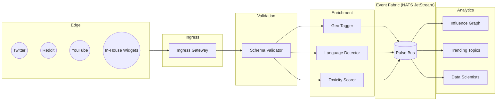

```markdown
# PulseSphere Architecture (v1.2)

> “Stream everything, lose nothing.”  
> — PulseSphere Design Motto

---

## Table of Contents

1. Executive Overview  
2. Core Design Principles  
3. High-Level Component Diagram  
4. Event Lifecycle  
5. Microservice Topology  
6. Data Model & Schemas  
7. Fault-Tolerance & Recovery  
8. Extensibility (Strategy Plug-Ins)  
9. Security & Compliance  
10. Deployment & Dev-Ops  
11. Observability Stack  
12. Appendix: Message Contracts  

---

## 1. Executive Overview

PulseSphere is a **real-time social pulse streaming platform** written entirely in C with a focus on deterministic performance, zero-copy data paths, back-pressure awareness, and memory safety through rigorous static analysis and runtime guards.

At ~5 M events/sec, each incoming *pulse* moves through a **five-stage streaming pipeline**:

1. **Ingress** – protocol fan-in & deserialization  
2. **Validation** – schema-on-read, signature & TTL checks  
3. **Enrichment** – geo-IP, language, toxicity, user graph lookup  
4. **Aggregation** – tumbling & sliding windows, materialized views  
5. **Egress** – fan-out to analytics lakes, dashboards, caches

---

## 2. Core Design Principles

| Principle                    | Rationale                                                                                     |
| ---------------------------- | ---------------------------------------------------------------------------------------------- |
| Immutable Events             | Enables replay, auditing, and idempotent re-processing                                         |
| Back-Pressure Propagation    | Prevents overload and cascading failure                                                        |
| Pluggable Enrichment         | Strategy Pattern provides runtime swap-outs without downtime                                  |
| Observability by Default     | All services emit OpenTelemetry spans, structured logs, and Prometheus metrics                |
| Defense-in-Depth             | Each boundary validates auth, quotas, and schema                                              |
| Fail Fast, Recover Faster    | Circuit breakers + WAL (Write-Ahead Log) for late events and exactly-once semantics           |

---

## 3. High-Level Component Diagram



---

## 4. Event Lifecycle

| Stage              | Latency Budget | Key Operations                             | Failure Policy              |
| ------------------ | -------------- | ------------------------------------------ | --------------------------- |
| Ingress            | ≤ 3 ms         | Protocol decode, decompress, CRC           | Drop malformed, log         |
| Validation         | ≤ 2 ms         | Avro schema, signature, TTL                | Quarantine invalid          |
| Enrichment         | ≤ 5 ms         | Geo lookup, language, toxicity             | Soft-fail & tag “partial”   |
| Aggregation        | ≤ 10 ms        | Window ops, pre-compute counters           | Replay from WAL             |
| Egress             | ≤ 4 ms         | Serialize, partition route                 | Retry w/ exponential back-off|

Total P99 latency target: **≤ 24 ms** end-to-end.

---

## 5. Microservice Topology

| Service                       | Replica Count | Language | Criticality | Horiz Scaling   |
| ----------------------------- | ------------- | -------- | ----------- | --------------- |
| `pulse-ingressd`              | 4-12          | C        | High        | Shard by source |
| `pulse-validatord`           | 6-18          | C        | High        | Hash by eventID |
| `pulse-enrichd` (geo)         | 12-48         | C        | Medium      | Pod autoscaler  |
| `pulse-enrichd` (language)    | 8-32          | C        | Medium      | Pod autoscaler  |
| `pulse-enrichd` (toxicity)    | 4-16          | C        | Medium      | GPU optional    |
| `pulse-windowd`               | 3-9           | C        | High        | Partition key   |
| `pulse-gateway` (GraphQL)     | 3-6           | C        | Medium      | Proxy L7        |
| `pulse-observability`         | 2-4           | Go       | High        | N/A             |

---

## 6. Data Model & Schemas

### 6.1 Base Pulse (Avro v1)

```json
{
  "type": "record",
  "name": "Pulse",
  "namespace": "com.pulsesphere",
  "fields": [
    {"name": "event_id",  "type": "string"},
    {"name": "source",    "type": "string"},
    {"name": "user_id",   "type": "string"},
    {"name": "timestamp", "type": "long"},
    {"name": "payload",   "type": "bytes"},
    {"name": "meta",      "type": {
        "type": "record",
        "name": "Meta",
        "fields": [
          {"name": "schema_ver", "type": "int"},
          {"name": "sig",        "type": "bytes"}
        ]
    }}
  ]
}
```

### 6.2 Enriched Pulse (v2)

Adds `geo`, `lang`, `toxicity`, and `ingestion_lag_ms`.

---

## 7. Fault-Tolerance & Recovery

• **Write-Ahead Log (WAL)** – Append-only on NVMe SSD; segment roll-over every 10 s.  
• **Idempotent Hand-Off** – `event_id` de-dup cache (Cuckoo filter, 60 M entries).  
• **Circuit Breakers** – Trip after 3 consecutive failures, 30-s half-open.  
• **Back-Pressure** – NATS *Flow Control + Max Inflight*; services publish health watermarks.  
• **Checkpointing** – Aggregators snapshot offsets to etcd every 500 ms (M=3 quorum).  
• **Chaos Testing** – Weekly Gremlin injection to force node, NIC, disk failures.

---

## 8. Extensibility (Strategy Plug-Ins)

All enrichment stages adhere to:

```c
typedef struct PulseEnrichmentStrategy {
    const char *name;
    int  (*init)(void **state);
    int  (*process)(void *state, PulseEvent *in, PulseEvent *out);
    void (*destroy)(void *state);
} PulseEnrichmentStrategy;
```

Dynamic libraries (`.so`) are loaded via `dlopen`/`dlsym` at runtime.  
Hot-swap is executed in < 50 ms thanks to:

1. Quiescing inflight workers  
2. Atomic pointer swap (`__atomic_store_n`)  
3. Warm-up cache priming

---

## 9. Security & Compliance

• Mutual-TLS (TLS 1.3) between services (SPIFFE IDs).  
• OAuth 2.0 / OIDC for dashboards & APIs.  
• GDPR / CCPA compliance: *user_id* hashed (BLAKE3), PII tokenized.  
• Audit log stream to immutable S3 bucket with 7-year retention.  
• SAST (Coverity) and DAST (ZAP) integrated into CI pipeline.

---

## 10. Deployment & Dev-Ops

• **Orchestrator** – Kubernetes (K8s) 1.29 with node pools by role.  
• **CI/CD** – GitHub Actions → Quay.io → ArgoCD (progressive rollout).  
• **Blue/Green** for minor versions; **Canary (1 %)** for major.  
• Secrets via Vault CSI; service Mesh via Linkerd (mTLS).  
• Container baseline: Alpine 3.19 + Musl libc + `-fno-plt` build flag.  
• Hardware reference:  
  – Dual Xeon 6430N (32c/64t)  
  – 256 GB DDR5  
  – 2×2 TB NVMe Gen4 (RAID-1)  
  – 100 GbE NIC (RoCEv2 enabled)

---

## 11. Observability Stack

| Signal     | Technology            | Retention | Notes                            |
| ---------- | --------------------- | --------- | -------------------------------- |
| Metrics    | Prometheus + Thanos   | 1 yr      | 15-s scrape interval             |
| Traces     | OpenTelemetry → Tempo | 30 d      | Batcher: OTLP/gRPC               |
| Logs       | Loki                  | 90 d      | JSON-structured + traceID        |
| Dashboards | Grafana               | N/A       | SLA, SLO boards (+5 burn alerts) |

SLIs (P99 latency, error rate, saturation) are exported per microservice and aggregated in Grafana Annotations for post-mortems.

---

## 12. Appendix: Message Contracts

All cross-team integrations must conform to the **Message Contract Policy**:

1. Version bump (minor) requires peer sign-off.  
2. Breaking change (major) triggers **Compatibility RFC**.  
3. No downstream consumer may parse `payload` bytes directly; only via provided schema library.

---

© 2024 PulseSphere, Inc. — Internal Use Only
```