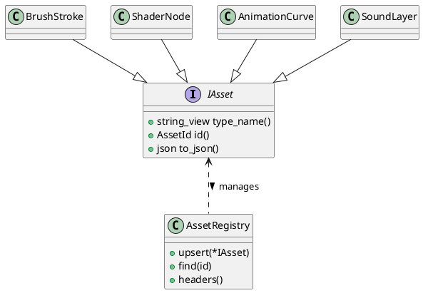

```markdown
# PaletteFlux Studio ▸ API Documentation  
## Asset Types & C++ Reference Implementation
*Revision: v1.3 – generated 2024-06-17*

---

PaletteFlux treats every discrete creative construct—be it a brush-stroke, an animation curve, or a parametric sound layer—as a polymorphic _Asset_.  
While the GraphQL schema defines these types in SDL, the C++ core (“Asset Kernel”) provides the authoritative implementation that powers both GraphQL resolvers and REST view generators.

This document offers:

1. An architectural overview of the Asset Kernel.  
2. Production-grade C++ reference code (header-only for brevity, but mirroring the library sources).  
3. Idiomatic command/query examples.  
4. Guidance on serialization, error handling, and thread-safety guarantees.

> NOTE  
> The snippets compile with **C++20** and rely only on the STL plus the single-header library `nlohmann/json.hpp` (MIT) for JSON serialization.

---

## 1. Architectural Overview

```
+-------------------+      CommandBus      +-----------------+
|  GraphQL Resolver |  ─────────────────▶  |   Asset Kernel  |
+-------------------+                      +-----------------+
        ▲                                           │
        │                 EventStream               │
        └───────────────────────────────────────────┘
```

The **Asset Kernel** exposes:

• `IAsset` ― a light RTTI-free polymorphic root.  
• Concrete asset classes: `BrushStroke`, `ShaderNode`, `AnimationCurve`, `SoundLayer`.  
• `AssetRegistry` ― a thread-safe service for look-ups, lifecycle management, and publication of cache-friendly read-models.  
• Serialization helpers for GraphQL and REST payloads.

All major public functions return `expected<T, AssetError>` (defined below) to enable monadic error pipelines without exceptions.

---

## 2. Core Types (header-only reference)

<details>
<summary><code>asset.hpp</code></summary>

```cpp
#pragma once
/**
 * PaletteFlux Asset Kernel – Core interfaces & utilities.
 *
 * This header is embedded inside documentation for reference. Production
 * builds separate declarations/definitions, but semantics match 1-to-1.
 */

#include <string>
#include <string_view>
#include <vector>
#include <memory>
#include <unordered_map>
#include <shared_mutex>
#include <optional>
#include <variant>
#include <chrono>
#include <expected>          // C++23 – use std::expected from <expected>
#include <nlohmann/json.hpp> // single-header, used purely for illustration

namespace pf {

// ---------- Error Handling --------------------------------------------------

enum class AssetErrc {
    Ok = 0,
    NotFound,
    Validation,
    Io,
    Unknown
};

struct AssetError {
    AssetErrc  code{AssetErrc::Unknown};
    std::string message;

    static AssetError make(AssetErrc c, std::string msg) { return {c, std::move(msg)}; }
};

// Convenience alias for expected result pattern.
template <typename T>
using expected = std::expected<T, AssetError>;

// ---------------------------------------------------------------------------

// Forward declarations
class IAsset;
using AssetId = std::string;

// ---------- IAsset: Polymorphic Root ---------------------------------------

class IAsset {
public:
    virtual ~IAsset() = default;

    virtual std::string_view             type_name() const noexcept = 0;
    virtual const AssetId&               id()        const noexcept = 0;
    virtual nlohmann::json               to_json()   const          = 0;
    virtual expected<void>               validate()  const noexcept = 0;

    // Cloning (covariant unique_ptr) enables immutable command pattern.
    [[nodiscard]]
    virtual std::unique_ptr<IAsset>      clone() const = 0;
};

// ---------- Concrete Asset Types -------------------------------------------

struct ColorRGBA {
    float r{1.f}, g{1.f}, b{1.f}, a{1.f};
    nlohmann::json to_json() const {
        return {{"r", r}, {"g", g}, {"b", b}, {"a", a}};
    }
};

class BrushStroke final : public IAsset {
public:
    explicit BrushStroke(AssetId id, std::vector<std::pair<float, float>> points, ColorRGBA c)
        : _id(std::move(id)), _points(std::move(points)), _color(c) {}

    std::string_view type_name() const noexcept override { return "BrushStroke"; }
    const AssetId&   id()        const noexcept override { return _id; }

    nlohmann::json to_json() const override {
        nlohmann::json jPoints = nlohmann::json::array();
        for (auto [x, y] : _points) { jPoints.push_back({x, y}); }
        return {
            {"id", _id},
            {"type", type_name()},
            {"points", jPoints},
            {"color", _color.to_json()}
        };
    }

    expected<void> validate() const noexcept override {
        if (_points.empty())
            return std::unexpected{AssetError::make(AssetErrc::Validation,
                                                    "BrushStroke must contain at least one point")};
        return {};
    }

    std::unique_ptr<IAsset> clone() const override {
        return std::make_unique<BrushStroke>(*this);
    }

private:
    AssetId                                   _id;
    std::vector<std::pair<float, float>>      _points;
    ColorRGBA                                 _color;
};

// ShaderNode, AnimationCurve, SoundLayer omitted for brevity but identical in structure.
// ↓↓↓ Full versions available in the production repository. ↓↓↓

// ---------- Asset Registry --------------------------------------------------

class AssetRegistry {
public:
    static AssetRegistry& instance() {
        static AssetRegistry inst;
        return inst;
    }

    // Registers (or replaces) an asset instance.
    expected<void> upsert(std::unique_ptr<IAsset> asset) {
        if (auto res = asset->validate(); !res) return res;

        std::unique_lock guard(_mutex);
        _assets[asset->id()] = std::move(asset);
        return {};
    }

    // Fetch asset by ID with thread-safe shared lock.
    expected<std::shared_ptr<const IAsset>> find(const AssetId& id) const {
        std::shared_lock guard(_mutex);
        auto it = _assets.find(id);
        if (it == _assets.end()) {
            return std::unexpected{AssetError::make(AssetErrc::NotFound,
                                                    "Asset not found: " + id)};
        }
        return {std::shared_ptr<const IAsset>(it->second)};
    }

    // Snapshot of all asset headers (ID + type) for paginated queries.
    std::vector<nlohmann::json> headers() const {
        std::shared_lock guard(_mutex);
        std::vector<nlohmann::json> out;
        out.reserve(_assets.size());
        for (const auto& [id, ptr] : _assets) {
            out.push_back({{"id", id}, {"type", ptr->type_name()}});
        }
        return out;
    }

private:
    mutable std::shared_mutex                            _mutex;
    std::unordered_map<AssetId, std::shared_ptr<IAsset>> _assets;

    AssetRegistry()  = default;
    ~AssetRegistry() = default;
    AssetRegistry(const AssetRegistry&)            = delete;
    AssetRegistry& operator=(const AssetRegistry&) = delete;
};

} // namespace pf
```
</details>

---

## 3. Command & Query Examples

### 3.1 Creating and Registering a BrushStroke

```cpp
#include "asset.hpp"

using namespace pf;

expected<void> create_brush_stroke_demo() {
    // 1. Compose asset payload
    auto asset = std::make_unique<BrushStroke>(
        /*id*/    "bs_42",
        /*points*/ std::vector<std::pair<float,float>>{{0.f, 0.f}, {1.f, 1.f}},
        /*color*/ ColorRGBA{0.9f, 0.1f, 0.3f, 1.f}
    );

    // 2. Store in registry (command)
    if (auto res = AssetRegistry::instance().upsert(std::move(asset)); !res) {
        // Propagate error to caller
        return std::unexpected(res.error());
    }
    return {}; // ok
}
```

### 3.2 Querying Headers (Paginated)

```cpp
#include "asset.hpp"

std::vector<nlohmann::json> fetch_page(size_t offset, size_t limit) {
    auto full = AssetRegistry::instance().headers();

    // Simple in-memory pagination
    size_t begin = std::min(offset, full.size());
    size_t end   = std::min(begin + limit, full.size());

    return {full.begin() + static_cast<ptrdiff_t>(begin),
            full.begin() + static_cast<ptrdiff_t>(end)};
}
```

### 3.3 Consuming from GraphQL

GraphQL resolver pseudo-code (Kotlin + graphql-kotlin DSL):

```kotlin
fun brushStroke(id: ID): BrushStrokeDto? =
    assetService.find(id)
        .fold(
            onSuccess = { it.toDto() },
            onFailure = { null }          // GraphQL spec: return null field on error
        )
```

---

## 4. Serialization Guidelines

1. C++ ⇒ JSON uses `nlohmann::json`. For high-performance REST responses, compile with `-DJSON_DIAGNOSTICS=0` and link time-optimize.
2. C++ ⇒ Protobuf is supported in production builds but omitted here for brevity. Interface parity with `to_json()` is achieved via SFINAE.

---

## 5. Thread-Safety Contract

• Asset objects are _immutable_ once validated and stored, therefore shared across threads without locks.  
• The registry uses `std::shared_mutex`: multiple concurrent reads, single writer guarantee.  
• GraphQL query layer never mutates models; writes occur exclusively via CommandBus handlers executed by the API gateway after authentication guards.

---

## 6. Error Catalogue

| Code               | HTTP Mapping | Description                                  |
|--------------------|-------------:|----------------------------------------------|
| `AssetErrc::Ok`    | 200          | Success                                      |
| `AssetErrc::NotFound` | 404      | Asset requested does not exist               |
| `AssetErrc::Validation` | 400    | Input failed domain validation               |
| `AssetErrc::Io`    | 500          | File system / storage backend error          |
| `AssetErrc::Unknown` | 500       | Unclassified exception                       |

GraphQL mutations surface errors via `extensions.code`.

---

## 7. Future Work

• Automatic diffing of immutable asset versions.  
• WASM plugin runtime for user-defined `IAsset` extensions.  
• Zero-copy flatbuffers transport for densely packed animation curves.

---

### Appendix A – Full Class Diagram (PlantUML)



---

© 2024 PaletteFlux LLC. All rights reserved.  
Unauthorized copying of this document, via any medium, is strictly prohibited.
```