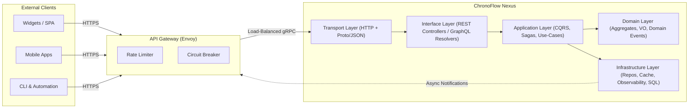
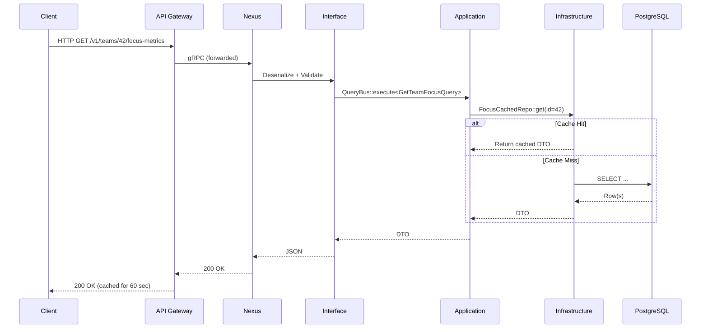
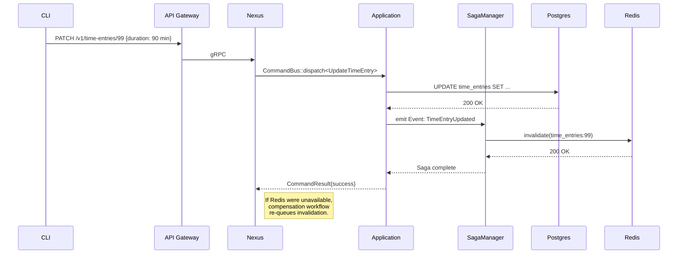

```markdown
# ChronoFlow Nexus – **Architecture Guide**

> Version: `v1.14`  
> Last updated: `2024-06-10`  
> Authors: Platform Engineering · Productivity Domain Team

This document is the single source-of-truth for how **ChronoFlow Nexus** is designed, how the C++ codebase is organized, and how the individual runtime components collaborate to fulfill both REST **and** GraphQL requests at scale.

---

## 1. Birds-Eye View



### 1.1 Core Tenets

1. **Layered Isolation** – Each layer is a standalone CMake target, exposing only a narrow public interface.  
2. **Command–Query Separation** – Commands mutate state; Queries never do.  
3. **Fail-Fast IO Path** – The p99 latency target is `< 45 ms` for all read-only queries under the 95th percentile load.  
4. **Observability First** – All layers emit structured logs, OpenTelemetry traces, **and** Prometheus metrics out-of-the-box.  
5. **No Foot-Guns** – The domain objects are immutable by default; any mutation produces a new instance or raises an exception.

---

## 2. Directory Layout (excerpt)

```
chrono_flow_nexus/
├── CMakeLists.txt
├── apps/
│   └── nexus_api/
│       ├── main.cpp
│       └── server_config.yaml
├── src/
│   ├── transport/
│   ├── interface/
│   ├── application/
│   ├── domain/
│   └── infrastructure/
├── config/
│   └── envoy.yaml
└── docs/
    └── ARCHITECTURE.md   ⬅ you are here
```

---

## 3. Layer Deep-Dive

### 3.1 Transport Layer (`src/transport/`)

* Powered by **Boost.Beast** for HTTP/1.1 and **gRPC** for streaming data.  
* Accepts both JSON and *binary Proto-buf* payloads.  
* Immediately performs:
  - Authentication & JWT parsing
  - Preliminary request validation
  - Span creation for distributed tracing

#### Simplified header

```cpp
// transport/http_server.hpp
#pragma once
#include <boost/beast.hpp>
#include "common/telemetry/span.hpp"

namespace chrono::transport {

class HttpServer final {
public:
    explicit HttpServer(net::io_context& ctx, Config cfg);
    void start();
private:
    void doAccept_();
    void onRequest_(http::request<http::string_body>&& req);

    net::io_context& ctx_;
    tcp::acceptor   acceptor_;
    Config          cfg_;
};

} // namespace chrono::transport
```

> ⚠ **Tip:** The server object lives in the `apps/` binary; unit tests spin up an in-process instance via **Boost.Test**.

---

### 3.2 Interface Layer (`src/interface/`)

* Houses **REST Controllers** and **GraphQL Resolvers** (`cppgraphqlgen`-generated).  
* Converts HTTP/gRPC DTOs to **Application DTOs**.  
* Implements API versioning: `v1` and `v2` share resolvers but map to different view models.

```cpp
// interface/graphql/focus_resolver.cpp (excerpt)
auto FocusResolver::resolveFocusMetric(
        const QueryContext& ctx,
        const metric_id& id) const -> Task<FocusMetricGQL> {

    GET_SPAN("FocusResolver::resolveFocusMetric");

    co_return co_await queryBus_.execute<GetFocusMetricQuery>(id)
        | [](auto&& domainMetric) { return toGraphQL(std::forward<decltype(domainMetric)>(domainMetric)); };
}
```

---

### 3.3 Application Layer (`src/application/`)

* **CQRS**: `CommandBus`, `QueryBus` are lightweight pub-sub buses using **std::variant** for type-safe dispatch.  
* **Sagas** for long-running orchestrations (e.g., backfilling analytics).  
* **Policies** encapsulate cross-cutting concerns: idempotency, throttling, RBAC.

```cpp
// application/query_bus.hpp
template <typename QueryT>
requires concepts::Query<QueryT>
auto QueryBus::execute(const QueryT& query) -> Task<typename QueryT::result_type> {
    static_assert(has_registered_handler<QueryT>,
                  "Query handler not registered with QueryBus");

    const auto& handler = registry_[typeid(QueryT)];
    co_return co_await std::any_cast<const IQueryHandler<QueryT>&>(handler).handle(query);
}
```

---

### 3.4 Domain Layer (`src/domain/`)

* Pure business logic, **zero** external dependencies except `absl::time`.  
* Implements **Aggregates** such as `TimeEntry`, `FocusSession`, `Team`.  
* **Domain Events** bubble up to be projected to read-models or external message queues.

```cpp
// domain/value_objects/Duration.hpp
#pragma once
#include <stdexcept>
#include <cstdint>

namespace chrono::domain {

class Duration final {
public:
    explicit constexpr Duration(std::int64_t millis = 0) : millis_(millis) {
        if (millis_ < 0) throw std::invalid_argument("Duration cannot be negative");
    }

    [[nodiscard]] constexpr std::int64_t millis() const noexcept { return millis_; }
    [[nodiscard]] constexpr double seconds() const noexcept { return millis_ / 1000.0; }

    friend constexpr Duration operator+(Duration lhs, Duration rhs) {
        return Duration{lhs.millis_ + rhs.millis_};
    }
private:
    std::int64_t millis_;
};

} // namespace chrono::domain
```

---

### 3.5 Infrastructure Layer (`src/infrastructure/`)

* **Persistence** – PostgreSQL via **libpqxx**.  
* **Caching** – Redis Cluster, with a home-grown L2 in-process **clock-pro** cache.  
* **Observability** – [fmtlog](https://github.com/MengRao/fmtlog) + **OpenTelemetry C++** exporter.  
* **Migration** – Declarative migrations executed by `flyway` at container startup (init-container).

```cpp
// infrastructure/repository/time_entry_postgres.cpp (excerpt)
TimeEntryRepoPostgres::Result
TimeEntryRepoPostgres::findById(const Uuid& id) noexcept {
    auto span = telemetry::startSpan("TimeEntryRepo.findById");
    try {
        pqxx::work tx{db_};
        auto row = tx.exec_prepared1("find_time_entry_by_id", id.to_string());
        tx.commit();
        return TimeEntryMapper::fromRow(row);
    } catch (const std::exception& ex) {
        log::error("DB error in findById: {}", ex.what());
        return tl::unexpected{ErrorCode::DB_FAILURE};
    }
}
```

---

## 4. Runtime Call Flows

### 4.1 Read-Only Query (Happy Path)



### 4.2 Write Command (Partial Failure & Saga Compensation)



---

## 5. Concurrency Model

1. **Transport** – Event-loop (`boost::asio`) with a fixed pool of `io_context`s.  
2. **CPU-bound** tasks are executed on a *separate* thread-pool (`folly::CPUThreadPoolExecutor`).  
3. **Long-running** background jobs leverage `std::jthread` + cancellation tokens.

```cpp
// common/executor/thread_pool.hpp
#pragma once
#include <folly/executors/CPUThreadPoolExecutor.h>

namespace chrono::exec {
inline folly::CPUThreadPoolExecutor& cpuPool() {
    static folly::CPUThreadPoolExecutor pool{
        std::thread::hardware_concurrency() * 2,
        std::make_shared<folly::NamedThreadFactory>("cpu-pool")};
    return pool;
}
} // namespace chrono::exec
```

---

## 6. Error Handling & Propagation

We employ **tl::expected** (type-safe `Result<T, E>`) throughout *Application* and *Infrastructure* layers:

```cpp
// application/error_codes.hpp
enum class ErrorCode : std::uint8_t {
    None             = 0,
    ValidationFailed = 1,
    NotFound         = 2,
    DbFailure        = 3,
    Timeout          = 4,
};
```

*User-facing* error shapes for REST **and** GraphQL are generated automatically and mapped from internal codes in the *Interface* layer.

---

## 7. Build & Packaging

1. **CMake 3.26** + [Conan v2] for dependency resolution.  
2. Multi-stage **Docker** build (scratch base → builder → runtime).  
3. Release binaries are **musl**-linked for minimal attack surface.  
4. GitHub Actions does:
   * `clang-tidy`, `cppcheck`, `include-what-you-use`  
   * Integration tests via Docker Compose  
   * Artifact upload to the internal Helm registry  

---

## 8. Extensibility FAQ

| What do I want to do?               | Where should I start?                           |
|------------------------------------|-------------------------------------------------|
| Add a new REST endpoint            | `src/interface/rest/` → create *controller*     |
| Expose a GraphQL field             | `schema.graphql` + `interface/graphql/`         |
| Create a background report/saga    | `src/application/sagas/`                        |
| Add a new domain aggregate         | `src/domain/<aggregate>/`                       |
| Switch caching provider            | Implement `ICache` in `src/infrastructure/cache/` and bind in `di.yml` |

---

## 9. Glossary

* **DTO** – Data Transfer Object  
* **VO** – Value Object  
* **CQRS** – Command Query Responsibility Segregation  
* **Saga** – Long-running transaction coordinator  
* **p99** – 99th percentile latency  

---

## 10. Changelog (ARCHITECTURE.md only)

| Date       | Author | Change |
|------------|--------|--------|
| 2024-06-10 | RM     | Added concurrency & error-handling sections |
| 2024-05-22 | EG     | Initial public draft |

---

> **© 2024 ChronoFlow Inc.** – All rights reserved.  
> Licensed under the **Apache 2.0** license.  
> For questions ping `#chrono-dev` on Slack.
```