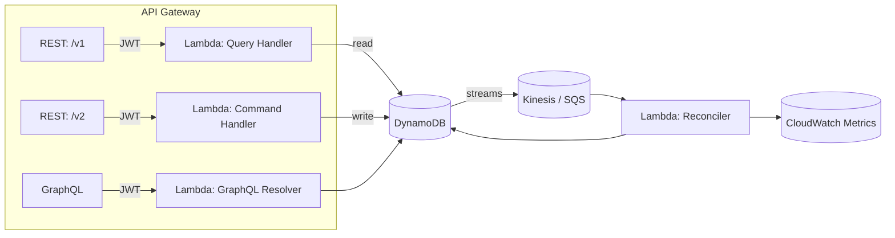

# VitalPulse CloudCare API &mdash; `api_rest`
A serverless, micro-orchestrated platform for streaming vital-signs, medication events, and clinician orders in real-time.


---

## Table of Contents
1.  [Key Features](#key-features)  
2.  [System Architecture](#system-architecture)  
3.  [Getting Started](#getting-started)  
4.  [Project Layout](#project-layout)  
5.  [API Overview](#api-overview)  
6.  [Error Handling](#error-handling)  
7.  [Rate Limiting](#rate-limiting)  
8.  [Pagination &amp; Filtering](#pagination--filtering)  
9.  [Request Validation](#request-validation)  
10. [Versioning Strategy](#versioning-strategy)  
11. [Observability](#observability)  
12. [Security](#security)  
13. [Local Development](#local-development)  
14. [CI / CD](#ci--cd)  
15. [Contributing](#contributing)  
16. [License](#license)  

---

## Key Features
* **Serverless compute:** AWS Lambda functions split into `command` (write) and `query` (read) paths to maximize scalability.  
* **Audit-grade error handling:** Structured, trace-aware responses based on [RFC 7807](https://tools.ietf.org/html/rfc7807).  
* **Fine-grained security:** SMART on FHIR & OAuth 2.0 with JWT scopes, tenant isolation, and KMS-encrypted data at rest.  
* **FHIR-compliant validation:** Requests are validated against FHIR R4 JSON Schemas.  
* **Rate Limiting:** Adaptive (`leaky-bucket`) rate control to protect from abusive medical-device traffic.  
* **GraphQL overlay:** Aggregates multiple REST endpoints into a single clinician-friendly schema.  
* **Versioned APIs:** `/v1` (GA) and `/v2` (beta) facilitate safe EHR migrations.  
* **Full observability:** AWS X-Ray tracing, CloudWatch dashboards, and custom CloudWatch metrics.  

---

## System Architecture


* **Command functions (`cmd-*`)** write to DynamoDB with conditional expressions for strong consistency.  
* **Query functions (`qry-*`)** read from dedicated GSIs with eventual consistency.  
* **Reconciler** normalizes telemetry streams, emits alerts, and feeds ML pipelines (not shown).  

---

## Getting Started

### Prerequisites
* Java 17 (Temurin)  
* AWS CLI (`aws sso login` recommended)  
* Docker 20+ (for local DynamoDB & SAM testing)  
* Maven 3.9.x  

### Quick Start
```bash
# 1. Clone & bootstrap
git clone https://github.com/vitalpulse/cloudcare-api.git
cd cloudcare-api

# 2. Spin up local infra (DynamoDB, API Gateway emulator, etc.)
make dev-up

# 3. Run unit tests & integration tests
mvn clean verify

# 4. Invoke a local Lambda
sam local invoke CmdCreateTelemetry \
  --event events/telemetry-create.json \
  --env-vars envs/local.json
```

---

## Project Layout
```
api_rest/
├── README.md
├── pom.xml
├── Makefile
├── sam-template.yaml      # AWS SAM specification
├── scripts/               # Utility & migration scripts
├── src
│   ├── main
│   │   ├── java/com/vitalpulse/cloudcare
│   │   │   ├── cmd/      # Command Lambdas (writes)
│   │   │   ├── qry/      # Query Lambdas (reads)
│   │   │   ├── graphql/  # GraphQL resolvers
│   │   │   ├── model/    # FHIR-compliant domain models
│   │   │   ├── repo/     # DynamoDB repositories
│   │   │   ├── service/  # Business logic layer
│   │   │   └── config/   # DI & utility classes
│   └── test
│       └── java/...      # JUnit 5 tests
└── terraform/             # (Optional) IaC for multi-region deployments
```

---

## API Overview

### v1 Endpoints (GA)
| Method | Path                              | Description                    | Auth Scope          |
|--------|-----------------------------------|--------------------------------|---------------------|
| GET    | `/v1/patients/{patientId}`        | Fetch patient demographics     | `patient.read`      |
| POST   | `/v1/telemetry`                   | Ingest vital-sign record       | `telemetry.write`   |
| GET    | `/v1/telemetry`                   | Stream vital-signs (websocket) | `telemetry.read`    |
| POST   | `/v1/medications`                 | Record medication event        | `medication.write`  |
| GET    | `/v1/orders/{orderId}`            | Retrieve clinician order       | `order.read`        |

### v2 (beta) Deltas
* `PATCH /v2/patients/{id}` — partial updates using JSON Patch  
* Enhanced GraphQL types (`PatientSummary`, `TelemetryTrend`)  

### Sample Request
```bash
curl -X POST https://api.vitalpulse.com/v1/telemetry \
  -H "Authorization: Bearer $TOKEN" \
  -H "Content-Type: application/fhir+json" \
  -d @samples/telemetry-heart-rate.json
```

---

## Error Handling
All error responses comply with RFC 7807 (`application/problem+json`).
```json
{
  "type":   "https://docs.vitalpulse.com/errors/validation-error",
  "title":  "Invalid FHIR payload",
  "status": 400,
  "detail": "Value 'bpm' is not a valid UCUM unit",
  "instance": "/v1/telemetry"
}
```
Lambdas propagate exceptions via the `ProblemException` utility; static factory helpers minimize boilerplate.

---

## Rate Limiting
* **Plan:** leaky-bucket algorithm in API Gateway.  
* **Burst:** 100 req/s, **Steady:** 1,000 req/min per device.  
* **Headers:**  
  * `X-RateLimit-Limit`, `X-RateLimit-Remaining`, `Retry-After`.  
* Exceeded calls return **HTTP 429** with a structured `problem+json` body.

---

## Pagination & Filtering
Cursor-based pagination is available for high-volume endpoints:

Query example:
```
GET /v1/telemetry?patientId=123
                 &from=2023-04-01T00:00:00Z
                 &cursor=eyJzIjoxNjgwMDAwMDB9
                 &limit=200
```
Response headers:
* `X-Next-Cursor` &mdash; pass into the next request.  
* `Cache-Control: max-age=30, public` for idempotent reads.

---

## Request Validation
Requests are validated in three stages:
1. **JSON Schema (FHIR R4):** Block malformed or unknown fields.  
2. **Custom Rules:** Device registration, patient consent, etc.  
3. **Business Policies:** Medication ordering privileges, formulary compliance.  

Validation failures short-circuit execution and emit **HTTP 400** responses.

---

## Versioning Strategy
* **URI Based:** `/v1`, `/v2`.  
* **Deprecation Policy:** Breaking changes announced 180 days prior; response header `Deprecation: <date>`.  
* **N-1 Support:** Previous GA version supported for at least one year.

---

## Observability
* **Tracing:** AWS X-Ray with 100 % sampling in non-prod, 5 % in prod.  
* **Metrics:** Custom CloudWatch metrics (`TelemetryIngestLatency`, `MedicationWriteErrors`).  
* **Logging:** Structured JSON via `logback-xml`; correlation IDs auto-injected.  
* **Dashboards:** CloudWatch & Grafana 8.

---

## Security
* **Authentication:** OAuth 2.0 / SMART on FHIR; supports SSO via hospital IdPs.  
* **Authorization:** Fine-grained JWT scopes checked in Lambda middleware.  
* **Data Protection:** KMS encryption, DynamoDB point-in-time recovery, S3 object lock for logs.  
* **Compliance:** HIPAA, SOC 2, ISO 27001.  

---

## Local Development

#### Environment Variables
| Variable                 | Example                          | Description                     |
|--------------------------|----------------------------------|---------------------------------|
| `DYNAMODB_ENDPOINT`      | `http://localhost:8000`          | Local DynamoDB instance         |
| `JWT_ISSUER`             | `https://auth.dev.hospital.com`  | OIDC issuer URL                 |
| `JWT_AUDIENCE`           | `cloudcare.api.dev`             | Expected audience               |
| `LOG_LEVEL`              | `DEBUG`                          | Log verbosity                   |

Export via `envs/local.json` for `sam local`.

#### Common Tasks
```bash
# Format & lint
mvn spotless:apply

# Start Tail Logs
sam logs -n CmdCreateTelemetry --tail
```

---

## CI / CD
### GitHub Actions (`.github/workflows/ci.yml`)
1. **Build & test** — runs `mvn verify`, caches Maven repos.  
2. **Security scan** — OWASP Dependency-Check & Snyk.  
3. **Package** — `sam package` → S3.  
4. **Deploy** — `sam deploy --no-confirm-changeset` to `dev` on merge; `prod` via manual approval.

### Release Tags
* `v1.X.Y` — patch/minor  
* `v2.X.Y-beta` — prerelease  

---

## Contributing
We :heart: pull requests!  
1. Fork → Create feature branch (`git checkout -b feat/my-awesome-thing`).  
2. Follow [Conventional Commits](https://www.conventionalcommits.org/) for commit messages.  
3. Ensure `mvn verify` & `make lint` pass.  
4. Open a PR & fill the template.

Code style: Google Java Style enforced by Spotless.

---

## License
```
Apache License 2.0
Copyright 2024 VitalPulse

Licensed under the Apache License, Version 2.0 (the "License");
you may not use this file except in compliance with the License.
...
```

---

© 2024 VitalPulse. All Rights Reserved.