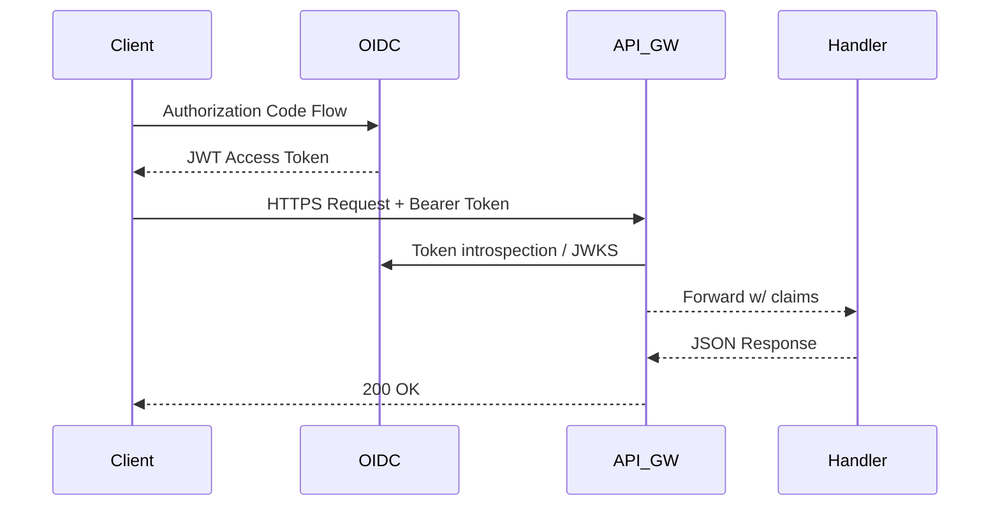

```markdown
# VitalPulse CloudCare API – Reference Architecture
_vitalpulse-cloudcare-api/docs/architecture.md_  
_Last updated: 2024-06-09_

---

## 1. Architectural Overview
VitalPulse CloudCare is a **serverless, micro-orchestrated** health-data exchange built on AWS.  
Each API endpoint is implemented as a lightweight Java 21 AWS Lambda function wired through
API Gateway (REST & GraphQL). The platform embraces **Command/Query Responsibility
Segregation (CQRS)**, clean hexagonal layering, and the **Repository pattern** to keep
persistence concerns isolated from domain logic.

```
                                                                 +-------------------+
                                                                 |   CloudWatch &    |
                                                                 |  X-Ray Tracing    |
                                                                 +---------+---------+
                                                                           ^
                                                                           |
+------------------+    +-------------------+     +------------------------|--------------+
|  Public Client   |    |  Clinical Client  |     |       Back-Office      |              |
| (Mobile Device)  |    |  (EHR, MD Portal) |     |  (Admin Dashboard)     |              |
+---------+--------+    +---------+---------+     +------------------------+--------------+
          |                       |                                  |                   |
          | HTTPS (SMART on FHIR) |                                  |                   |
          v                       v                                  v                   v
+-----------------------------------------------------------------------------------------------+
|                                       API Gateway                                             |
|                +-------------------+   +-------------------+   +-------------------+          |
|                |  REST  Endpoints  |   | GraphQL Endpoints |   |  WebSocket (RT)   |          |
|                +---------+---------+   +---------+---------+   +---------+---------+          |
+--------------------------|--------------------|--------------------------|---------------------+
                           |                    |                          |
                +----------v----------+ +-------v-------+        +---------v--------+
                |  Command Lambda(s)  | | Query Lambda  |        | Streaming Lambda |
                +----------+----------+ +-------+-------+        +---------+--------+
                           |                    |                          |
     +---------------------v--+        +--------v--------+        +--------v--------+
     |   DynamoDB (Write)     |        | DynamoDB (Read) |        |  Kinesis Data   |
     |  Orders / Telemetry    |        |  Projections    |        |     Streams     |
     +------------------------+        +-----------------+        +-----------------+
```

---

## 2. Package Structure

| Java Package                                | Responsibility                    |
|---------------------------------------------|-----------------------------------|
| `com.vitalpulse.cloudcare.api.entrypoint`   | Lambda handlers / API Gateway     |
| `com.vitalpulse.cloudcare.domain`           | Aggregate roots & value objects   |
| `com.vitalpulse.cloudcare.application`      | Commands, queries, service layer  |
| `com.vitalpulse.cloudcare.infrastructure`   | DynamoDB/Kinesis repositories     |
| `com.vitalpulse.cloudcare.shared`           | DTOs, exceptions, tracing helpers |

---

## 3. Lambda Handler Blueprint (Java)

The following code illustrates a **Query** Lambda exposing `/v1/patients/{id}/vitals` with
pagination, FHIR validation, and centralized exception mapping.

```java
package com.vitalpulse.cloudcare.api.entrypoint;

import com.amazonaws.services.lambda.runtime.Context;
import com.amazonaws.services.lambda.runtime.RequestHandler;
import com.fasterxml.jackson.core.JsonProcessingException;
import com.fasterxml.jackson.databind.ObjectMapper;
import com.vitalpulse.cloudcare.application.query.GetPatientVitalsQuery;
import com.vitalpulse.cloudcare.application.service.QueryBus;
import com.vitalpulse.cloudcare.shared.dto.ApiError;
import com.vitalpulse.cloudcare.shared.dto.ApiResponse;
import com.vitalpulse.cloudcare.shared.exception.DomainException;
import com.vitalpulse.cloudcare.shared.exception.NotFoundException;
import com.vitalpulse.cloudcare.shared.tracing.Trace;

import java.util.Map;

public final class GetPatientVitalsHandler
        implements RequestHandler<Map<String, Object>, ApiResponse> {

    private static final ObjectMapper MAPPER = new ObjectMapper();
    private final QueryBus queryBus = QueryBus.defaultBus();
    private final Trace trace = Trace.get();

    @Override
    public ApiResponse handleRequest(Map<String, Object> input, Context context) {
        trace.begin("GetPatientVitalsHandler");
        try {
            // Path parameters delivered by API Gateway
            String patientId = (String) ((Map<?, ?>) input.get("pathParameters")).get("id");
            int limit  = Integer.parseInt(getQueryParam(input, "limit", "25"));
            String cursor = getQueryParam(input, "cursor", null);

            var query  = new GetPatientVitalsQuery(patientId, limit, cursor);
            var result = queryBus.dispatch(query);

            trace.success();
            return ApiResponse.ok(result);
        } catch (NotFoundException nf) {
            trace.error(nf);
            return ApiResponse.notFound(nf.getMessage());
        } catch (DomainException de) {
            trace.error(de);
            return ApiResponse.badRequest(ApiError.of(de));
        } catch (Exception ex) {
            trace.error(ex);
            return ApiResponse.internalError("Internal server error");
        } finally {
            trace.end();
        }
    }

    private String getQueryParam(Map<String, Object> input,
                                 String key, String defaultVal) {
        var params = (Map<?, ?>) input.getOrDefault("queryStringParameters", Map.of());
        return (String) params.getOrDefault(key, defaultVal);
    }
}
```

### Key Points
1. **Trace SDK** wraps X-Ray and MDC logging to emit consistent spans.  
2. **QueryBus** decouples handlers from delivery mechanisms; a similar `CommandBus` exists.  
3. All exceptions are mapped to `ApiResponse` objects so API Gateway can proxy clean JSON.

---

## 4. Command & Query Separation

Command handlers live in separate Lambdas with **write-optimised** DynamoDB capacity,
whereas query Lambdas attach to **read-replica** tables or DAX.

```java
package com.vitalpulse.cloudcare.application.command;

public record RecordMedicationCommand(
        String patientId,
        String medicationCode,   // RxNorm
        double doseMg,
        String route,
        String orderedByClinicianId) {}
```

```java
package com.vitalpulse.cloudcare.application.handler;

import com.vitalpulse.cloudcare.application.command.RecordMedicationCommand;
import com.vitalpulse.cloudcare.domain.MedicationOrder;
import com.vitalpulse.cloudcare.infrastructure.repository.MedicationOrderRepository;
import com.vitalpulse.cloudcare.shared.event.EventPublisher;

public final class RecordMedicationHandler {

    private final MedicationOrderRepository repository;
    private final EventPublisher publisher;

    public RecordMedicationHandler(MedicationOrderRepository repository,
                                   EventPublisher publisher) {
        this.repository = repository;
        this.publisher  = publisher;
    }

    public void handle(RecordMedicationCommand cmd) {
        MedicationOrder order = MedicationOrder.from(cmd);
        repository.save(order);
        publisher.publish(order.toEvent()); // Push to EventBridge
    }
}
```

---

## 5. Security Pipeline

1. **OAuth 2.0 / SMART on FHIR** authorizer Lambda attaches JWT claims (org, user role).
2. **Fine-grained IAM Policies** restrict DynamoDB access per tenant.
3. All FHIR resources are validated via [HAPI FHIR validator](https://hapifhir.io/).



---

## 6. Rate Limiting & Throttling

API Gateway usage plans impose a tenant-level burst/steady-rate.
For device traffic, a custom **Leaky Bucket** algorithm runs in Redis-compatible **Elasticache**.

```java
package com.vitalpulse.cloudcare.infrastructure.ratelimit;

import io.lettuce.core.api.sync.RedisCommands;

public final class RateLimiter {

    private static final String LUA_TOKEN_BUCKET = """
        local key       = KEYS[1]
        local maxBurst  = tonumber(ARGV[1])
        local refill    = tonumber(ARGV[2])
        local now       = tonumber(ARGV[3])
        local bucket    = redis.call('HMGET', key, 'tokens', 'timestamp')
        local tokens    = bucket[1] and tonumber(bucket[1]) or maxBurst
        local ts        = bucket[2] and tonumber(bucket[2]) or now
        tokens = math.min(maxBurst, tokens + (now - ts) * refill)
        if tokens < 1 then
          return {-1, tokens}
        else
          tokens = tokens - 1
          redis.call('HMSET', key, 'tokens', tokens, 'timestamp', now)
          redis.call('EXPIRE', key, 3600)
          return {1, tokens}
        end
        """;

    private final RedisCommands<String, String> redis;
    private final int maxBurst;
    private final double refillRatePerMs;

    public RateLimiter(RedisCommands<String, String> redis,
                       int maxBurst,
                       int refillPerSecond) {
        this.redis             = redis;
        this.maxBurst          = maxBurst;
        this.refillRatePerMs   = refillPerSecond / 1000.0;
    }

    public boolean allow(String tenantId) {
        long now = System.currentTimeMillis();
        var resp = redis.eval(LUA_TOKEN_BUCKET,
                              io.lettuce.core.ScriptOutputType.MULTI,
                              new String[]{tenantId},
                              String.valueOf(maxBurst),
                              String.valueOf(refillRatePerMs),
                              String.valueOf(now));
        return ((Long) resp.get(0)) == 1;
    }
}
```

---

## 7. Observability

* **Structured JSON logs** emitted via Logback → CloudWatch Logs.  
* **AWS X-Ray** enabled for end-to-end tracing.  
* Custom metrics (`VitalSignIngestLatency`, `FHIRValidationErrors`) published to CloudWatch.

```java
trace.metric("VitalSignIngestLatency", latencyMs)
     .tag("patientId", patientId)
     .namespace("VitalPulse/CloudCare")
     .emit();
```

---

## 8. Deployment Pipeline (CDK)

* Monorepo builds via **Maven**; **Spotless** enforces code style.  
* `cdk synth`, `cdk deploy` run in GitHub Actions; all stacks are parameterised per stage.

---

## 9. Appendix

1. **FHIR Version Support**: STU3, R4 (default), R5 (beta).  
2. **API Versions**: `/v1/` GA, `/v2beta/` runs parallel.  
3. **Data Residency**: Multi-region deployment (us-east-1, us-west-2) via Route 53 latency routing.

---
_VitalPulse CloudCare © 2024 VitalPulse Health, Inc._
```