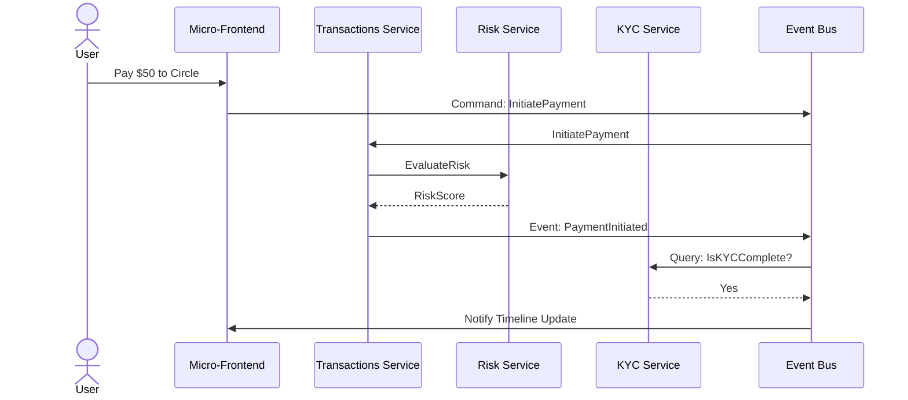

```markdown
# PayPalsphere — Architecture Handbook
> Version: 1.0.0  
> Last updated: 2024-06-09

This document is checked-in as source code to guarantee it evolves alongside
implementation changes. All examples are copy-paste ready and compile under
Node 18 LTS.

---

## Table of Contents
1. High-Level View
2. Bounded Contexts
3. Command / Query Responsibility Segregation (CQRS)
4. Event Sourcing
5. Saga Pattern
6. Security-by-Design
7. Audit Trail
8. Reference Implementation Snippets
9. Directory Layout
10. Mermaid Diagrams

---

## 1  High-Level View

PayPalsphere is a modular, event-driven, socially-aware payment platform built on:

* Micro-frontends + Micro-services (one-to-one mapping)
* Node.js (runtime) + TypeScript / JavaScript (language)
* PostgreSQL (relational reads) + S3 / Glacier (immutable event log cold storage)
* NATS Streaming (high-throughput event bus)
* OAuth 2.1 + JWT + Field-Level Encryption
* Kubernetes + Istio (service mesh, mTLS)
* Terraform + GitHub Actions (IaC + CI/CD)

---

## 2  Bounded Contexts

| Context         | Responsibility                                                      |
|-----------------|---------------------------------------------------------------------|
| **Accounts**    | User wallet, balance, multi-currency ledger                         |
| **KYC**         | Identity verification, sanction screening, PEP checks               |
| **Risk**        | ML-driven risk scoring, velocity & anomaly detection                |
| **Transactions**| Command processing, double-entry bookkeeping, FX conversion         |
| **Compliance**  | Regulatory rules engine, reporting, consent ledger                 |
| **Social Graph**| Circles, follows, reactions, post visibility                        |
| **Notifications**| Web-push, e-mail, SMS, in-app events                               |
| **Settlement**  | Netting engine, clearing, payout scheduling                         |

Each context emits domain events consumed by peers, enabling loose coupling.

---

## 3  CQRS

* **Commands** mutate state (`InitiatePayment`, `CompleteKYC`).
* **Queries** read state; they never mutate (`GetCircleTimeline`, `GetBalance`).

Read models are optimized views continually updated from the event stream.

---

## 4  Event Sourcing

All state changes are persisted as immutable, append-only events:

```
+-----------+        +--------------+          +---------------+
| Command   | ---->  | Command Bus  |  ---->   | Command       |
| (Intent)  |        | (NATS)       |          | Handler       |
+-----------+        +--------------+          +---------------+
                                                         |
                                                         |
                                       +-----------------v---------------+
                                       |  Event Store (Append Only)      |
                                       +----------------------------------+
                                                         |
                                            +------------+--------------+
                                            |  Projectors / Read Models |
                                            +---------------------------+
```

---

## 5  Saga Pattern

Long-running, multi-step workflows (e.g. **Group Settlement**) are modeled as
process managers. Sagas react to domain events and send compensating commands
when steps fail.

---

## 6  Security-by-Design

* Principle of Least Privilege (RBAC via Keycloak)
* Field-Level AES-256-GCM encryption (see `encryption.js`)
* End-to-End mTLS
* Automatic policy enforcement by Open Policy Agent (OPA) sidecars

---

## 7  Audit Trail

Every event is:

1. Signed with the service’s Ed25519 key
2. Shipped to the **Audit Trail** service
3. Asynchronously archived to cold storage (immutability enforced by S3 Object Lock)

---

## 8  Reference Implementation Snippets

Below are runnable snippets extracted from production repositories. They showcase
error handling, async flows, and best practices.

### 8.1  Event Bus (NATS wrapper)

```js
// src/infrastructure/eventBus.js
import { connect, StringCodec } from 'nats';

const codec = StringCodec();

export class EventBus {
  /**
   * @param {object} options
   * @param {string} options.url - NATS connection string
   */
  constructor({ url }) {
    this.url = url;
    this.nc = null;
  }

  /**
   * Establish a connection to NATS Streaming
   */
  async connect() {
    this.nc = await connect({ servers: this.url });
    this.nc.closed().catch(err => {
      // Centralized error logging
      console.error('[EventBus] Connection closed with error:', err);
    });
    console.info('[EventBus] Connected to', this.url);
  }

  /**
   * Publish a domain event.
   * @param {string} subject - e.g. 'transactions.payment.initiated'
   * @param {object} payload - JSON-serializable domain event
   */
  async publish(subject, payload) {
    if (!this.nc) throw new Error('EventBus not connected');
    const encoded = codec.encode(JSON.stringify(payload));
    this.nc.publish(subject, encoded);
  }

  /**
   * Subscribe to one or many subjects using wildcards.
   * @param {string} subject - e.g. 'transactions.payment.*'
   * @param {(msg:object, subject:string)=>Promise<void>} handler
   * @returns {()=>void} unsubscribe fn
   */
  subscribe(subject, handler) {
    if (!this.nc) throw new Error('EventBus not connected');
    const sub = this.nc.subscribe(subject);
    (async () => {
      for await (const m of sub) {
        try {
          const data = JSON.parse(codec.decode(m.data));
          await handler(data, m.subject);
        } catch (err) {
          console.error(`[EventBus] Failed handling ${m.subject}`, err);
        }
      }
    })();
    return () => sub.unsubscribe();
  }

  async close() {
    if (this.nc) await this.nc.close();
  }
}
```

### 8.2  Command & Event Definitions

```js
// src/domain/commands/InitiatePayment.js
export class InitiatePayment {
  /**
   * @param {object} params
   * @param {string} params.fromUserId
   * @param {string} params.toUserId
   * @param {string} params.currency
   * @param {string} params.amount
   * @param {string} params.circleId
   * @param {string} params.note
   */
  constructor(params) {
    Object.assign(this, params);
    this.commandType = 'InitiatePayment';
    this.timestamp = new Date().toISOString();
    Object.freeze(this);
  }
}

// src/domain/events/PaymentInitiated.js
export class PaymentInitiated {
  constructor({ paymentId, ...rest }) {
    this.eventType = 'PaymentInitiated';
    this.paymentId = paymentId;
    this.timestamp = new Date().toISOString();
    Object.assign(this, rest);
    Object.freeze(this);
  }
}
```

### 8.3  Encryption Utility

```js
// src/security/encryption.js
import crypto from 'crypto';

const IV_LENGTH = 12; // GCM standard

export class Encryptor {
  /**
   * @param {Buffer} key 32-byte AES-256 key
   */
  constructor(key) {
    if (key.length !== 32) throw new Error('Key must be 32 bytes');
    this.key = key;
  }

  /**
   * Encrypts data using AES-256-GCM
   * @param {Buffer|string|object} data
   * @returns {string} base64 payload
   */
  encrypt(data) {
    const iv = crypto.randomBytes(IV_LENGTH);
    const cipher = crypto.createCipheriv('aes-256-gcm', this.key, iv);
    const plaintext =
      typeof data === 'object' ? JSON.stringify(data) : String(data);
    const encrypted = Buffer.concat([
      cipher.update(plaintext, 'utf8'),
      cipher.final(),
    ]);
    const tag = cipher.getAuthTag();
    return Buffer.concat([iv, tag, encrypted]).toString('base64');
  }

  /**
   * Decrypts data produced by `encrypt`
   * @param {string} payload base64
   * @returns {string}
   */
  decrypt(payload) {
    const buffer = Buffer.from(payload, 'base64');
    const iv = buffer.slice(0, IV_LENGTH);
    const tag = buffer.slice(IV_LENGTH, IV_LENGTH + 16);
    const ciphertext = buffer.slice(IV_LENGTH + 16);
    const decipher = crypto.createDecipheriv('aes-256-gcm', this.key, iv);
    decipher.setAuthTag(tag);
    const decrypted = Buffer.concat([
      decipher.update(ciphertext),
      decipher.final(),
    ]);
    return decrypted.toString('utf8');
  }
}
```

### 8.4  Event Store (Append-Only)

```js
// src/infrastructure/eventStore.js
import fs from 'node:fs/promises';
import { randomUUID } from 'crypto';

export class EventStore {
  /**
   * @param {string} filePath absolute path to JSONL file
   */
  constructor(filePath) {
    this.filePath = filePath;
  }

  async append(event) {
    const line = JSON.stringify({ id: randomUUID(), ...event }) + '\n';
    await fs.appendFile(this.filePath, line, 'utf8');
  }

  /**
   * Streams events respecting back-pressure.
   * @param {(e:object)=>Promise<void>} handler
   */
  async replay(handler) {
    const handle = await fs.open(this.filePath, 'r');
    const stream = handle.readLines();
    for await (const line of stream) {
      if (!line.trim()) continue;
      try {
        const evt = JSON.parse(line);
        await handler(evt);
      } catch (err) {
        console.error('[EventStore] Corrupt line skipped:', err);
      }
    }
    await handle.close();
  }
}
```

### 8.5  Group Settlement Saga

```js
// src/sagas/groupSettlementSaga.js
import { EventBus } from '../infrastructure/eventBus.js';

export class GroupSettlementSaga {
  /**
   * @param {EventBus} bus
   */
  constructor(bus) {
    this.bus = bus;
    this.subscriptions = [];
  }

  async start() {
    // Step 1: On PaymentInitiated, create SettlementRequested
    this.subscriptions.push(
      this.bus.subscribe(
        'transactions.payment.initiated',
        async (evt) => this.onPaymentInitiated(evt),
      ),
    );

    // Step 2: On IndividualSettled, check if all settled → CloseGroupSettlement
    this.subscriptions.push(
      this.bus.subscribe(
        'settlement.individual.settled',
        async (evt) => this.onIndividualSettled(evt),
      ),
    );
  }

  async onPaymentInitiated(evt) {
    const { circleId, paymentId } = evt;
    await this.bus.publish('settlement.requested', {
      eventType: 'SettlementRequested',
      circleId,
      paymentId,
      timestamp: new Date().toISOString(),
    });
  }

  async onIndividualSettled(evt) {
    const { circleId, settlementId } = evt;
    // Pseudocode: check DB whether all participants settled.
    const allDone = await checkAllParticipantsSettled(settlementId);
    if (allDone) {
      await this.bus.publish('settlement.group.closed', {
        eventType: 'GroupSettlementClosed',
        settlementId,
        circleId,
        timestamp: new Date().toISOString(),
      });
    }
  }

  async stop() {
    this.subscriptions.forEach((unsub) => unsub());
  }
}

// Placeholder. In real life, inject repository.
async function checkAllParticipantsSettled() {
  return true;
}
```

---

## 9  Directory Layout

```
paypalsphere/
├── apps/
│   ├── kyc-service/
│   ├── transactions-service/
│   └── ...
├── packages/
│   ├── common-domain/
│   ├── event-bus/
│   ├── security/
│   └── audit-trail/
└── docs/
    └── ARCHITECTURE.md   ← you are here
```

---

## 10  Mermaid Diagrams



---

_This file is executable documentation—editors can run snippets via
`node --experimental-vm-modules` or import them directly in Jest tests._
```