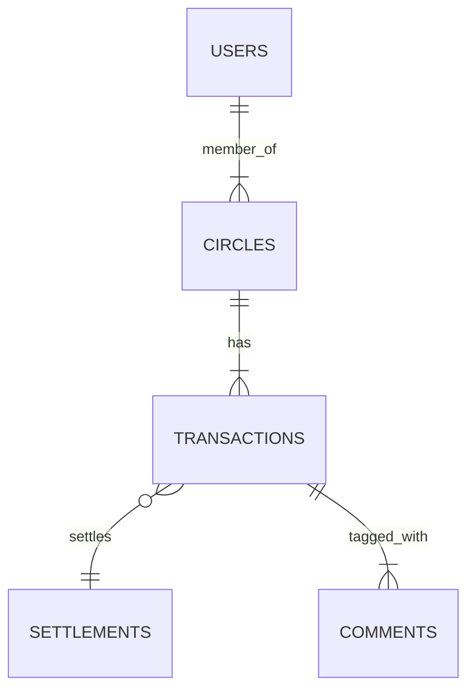
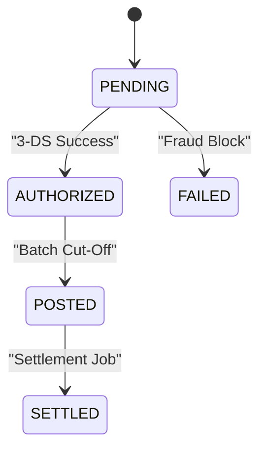

# PayPalsphere Public API  
Social-Driven Payments & Settlement Platform  
Version: **v1.4.0**  Last updated: **2024-05-07**

---

## 🚀 Quick Start

```bash
# 1. Signup for a developer account
curl -X POST https://api.paypalsphere.com/v1/auth/register \
  -d '{ "email": "dev@example.com", "password": "•••" }'

# 2. Exchange credentials for an access token (OAuth2 – client_credentials)
curl -X POST https://api.paypalsphere.com/v1/oauth/token \
  -d 'grant_type=client_credentials' \
  -u '<client_id>:<client_secret>'
```

```javascript
// Node.js Example (ESM)
import PayPalSphere from '@paypalsphere/sdk';

const sphere = new PayPalSphere({
  clientId:     process.env.SPHERE_CLIENT_ID,
  clientSecret: process.env.SPHERE_CLIENT_SECRET,
  env:          'production' // or 'sandbox'
});

const { access_token } = await sphere.auth.clientCredentials();
```

---

## 🔑 Authentication

| Method          | Flow                    | Expiry | Notes                    |
| --------------- | ----------------------- | ------ | ------------------------ |
| OAuth2          | client_credentials      | 2 h    | Server-to-server machine |
| OAuth2          | authorization_code (+PKCE) | 1 h | End-user delegated auth  |
| mTLS            | Two-way TLS (optional)  | N/A    | PCI DSS lvl 1 endpoints  |

Scopes are additive. A sample token payload:

```jsonc
{
  "sub": "app_79cea43cf8",
  "scp": ["circles:read", "payments:write", "kyc:read"],
  "aud": "paypalsphere",
  "iat": 1715150810,
  "exp": 1715158010
}
```

---

## 🗄️ Resource Model



* **Users** – wallet holders, KYC verified  
* **Circles** – social grouping of users  
* **Transactions** – payments, requests, or splits  
* **Settlements** – multi-leg clearing records  
* **Comments/Reactions** – social metadata attached to a transaction  

---

## 🌐 Base URLs

| Environment | REST                | WebSocket (events)        |
| ----------- | ------------------- | ------------------------- |
| Sandbox     | `https://sandbox-api.paypalsphere.com/v1` | `wss://sandbox-events.paypalsphere.com` |
| Production  | `https://api.paypalsphere.com/v1`         | `wss://events.paypalsphere.com` |

---

## 🔁 Idempotency

Provide an `Idempotency-Key` header (UUIDv4) for *POST* and *PATCH* requests. PayPalsphere guarantees that repeating requests with the same key will not produce duplicate side-effects for **48 h**.

---

## 📖 Endpoints

### 1. Circles

`GET /v1/circles`

Returns circles visible to the authenticated user.

```bash
curl -H "Authorization: Bearer $TOKEN" \
     https://api.paypalsphere.com/v1/circles?limit=25&cursor=abc
```

#### Response

```jsonc
{
  "data": [
    {
      "id": "circle_1e4a9",
      "name": "Ski Trip 2024",
      "balance": "125.43",
      "currency": "USD",
      "members": 5,
      "created_at": "2024-02-15T12:18:21Z"
    }
  ],
  "paging": { "next_cursor": "def", "previous_cursor": null }
}
```

### 2. Payments

`POST /v1/payments`

```javascript
await sphere.payments.create({
  circleId: 'circle_1e4a9',
  amount:   '59.99',
  currency: 'USD',
  note:     'Dinner at Aspen',
  split: [
    { userId: 'usr_alice', share: '29.99' },
    { userId: 'usr_bob',   share: '30.00' }
  ],
  metadata: { tripId: 'trp_9aa' } // custom key–value
});
```

Body parameters:

| Field      | Type    | Required | Notes                                 |
| ---------- | ------- | -------- | ------------------------------------- |
| circleId   | string  | ✔️       | Owning circle                         |
| amount     | decimal | ✔️       | ISO-4217 compliant                    |
| currency   | string  | ✔️       | 3-letter code                         |
| note       | string  |          | Visible in timeline                   |
| split      | array   |          | If omitted, defaults to payer-only    |
| metadata   | object  |          | Private key-value (max 10 pairs)      |

Status transitions use event sourcing:



---

## 🪝 Webhooks & Event Bus

Every domain event is broadcast over:

1. REST-Backed Webhooks (signed with Ed25519)  
2. WebSocket Streams (JSON over text frames)  

### Sample `payment.posted` Event

```json
{
  "id": "evt_8734af",
  "type": "payment.posted",
  "occurred_at": "2024-04-26T19:04:11.104Z",
  "signature": "SIGv2:63b7ec...",
  "data": {
    "payment_id": "pay_f1ad7",
    "circle_id": "circle_1e4a9",
    "amount": "59.99",
    "currency": "USD",
    "status": "POSTED"
  },
  "meta": {
    "tenant": "tenant_eu_west",
    "schema": "paypalsphere.events.payment@1.1.0"
  }
}
```

Verify signature using our published JWKS endpoint:  
`GET /.well-known/jwks.json`

---

## 🛡️ Security Guidelines

1. Communications secured via **TLS 1.3** (minimum).  
2. Field-level encryption applied to PAN & personally-identifiable info.  
3. API rate limits: **2000 req / min** per app, token bucket.  
4. All write operations require the scope `*_write`.  
5. `X-Content-Signature` header required when sending inbound webhooks to us.

> BCP 195 compliance & PCI DSS v4.0 controls are continuously audited by our Security & GRC team.

---

## 🧑‍💻 SDK Reference (JavaScript)

```bash
npm i @paypalsphere/sdk
```

```typescript
import { CirclesApi } from '@paypalsphere/sdk';

const circles = new CirclesApi({ accessToken: process.env.SPHERE_TOKEN });

try {
  for await (const circle of circles.list({ pageSize: 50 })) {
    console.log(`${circle.name}: $${circle.balance}`);
  }
} catch (error) {
  if (error.isRateLimit) {
    console.warn('Back-off & retry after: ', error.retryAfter);
  } else {
    throw error;
  }
}
```

---

## ☑️ Error Catalogue

| Code | HTTP | Title          | Retryable | Description                               |
| ---- | ---- | -------------- | --------- | ----------------------------------------- |
| `E1001` | 400 | ValidationError | ✖️ | Invalid payload shape or missing field    |
| `E2003` | 401 | Unauthorized  | ✖️ | Token expired or insufficient scope       |
| `E3007` | 409 | IdempotentConflict | ✔️ | Duplicate `Idempotency-Key` with diff body |
| `E4004` | 422 | KycUnverified | ✖️ | User lacks required KYC Tier              |
| `E5009` | 429 | RateLimited   | ✔️ | Wait specified seconds in `Retry-After`   |
| `E9000` | 500 | InternalError | ✔️ | Unexpected server condition               |

Example error payload:

```json
{
  "error": {
    "code": "E4004",
    "message": "KYC tier insufficient for transfer > €15,000",
    "correlation_id": "c5ed8ca3-9bbd-4d91",
    "timestamp": "2024-05-07T15:08:11Z"
  }
}
```

---

## 📜 Changelog (excerpt)

| Version | Date       | Notes                                                                |
| ------- | ---------- | -------------------------------------------------------------------- |
| 1.4.0   | 2024-05-07 | Added PKCE support & Ed25519 webhook signatures                      |
| 1.3.0   | 2024-02-19 | Event schema revisions, Settlement endpoints GA                      |
| 1.2.1   | 2023-11-29 | mTLS for high-risk corridors, Rate limit raised to 2k rpm            |
| 1.0.0   | 2023-07-15 | Public launch                                                        |

Full changelog: [`CHANGELOG.md`](../CHANGELOG.md)

---

## 🧩 Contributing & Support

• API Issues → [`/issues`](https://github.com/PayPalsphere/fintech_payment/issues)  
• Developer chat → `#paypalsphere-dev` on Slack  
• Status page → <https://status.paypalsphere.com>

---

## 📄 License

PayPalsphere REST & Events API is distributed under the **Apache 2.0** license. See [`LICENSE`](../../LICENSE) for details.