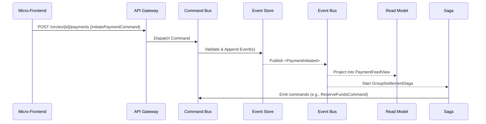

```markdown
# CQRS & Event Sourcing in **PayPalsphere**

> “Every intent is an immutable event; every event is an auditable story.”

This document lays out the reference implementation, design rationales, and operational guidelines for PayPalsphere’s Command Query Responsibility Segregation (CQRS) plus Event Sourcing (ES) stack.

## Table of Contents
1. Rationale & Core Principles  
2. High-Level Data Flow  
3. Event Taxonomy  
4. Code Walk-through  
   - Commands & Command Handlers  
   - Domain Aggregates  
   - Event Store Adapter  
   - Projections / Read Models  
   - Sagas & Process Managers  
5. Snapshots & Replays  
6. Observability & Audit Trail  
7. Security Considerations  
8. Further Reading  

---

## 1. Rationale & Core Principles

* **Immutability ≙ Truth** – every user intent (command) is validated, transformed into an immutable *event*, signed, and appended to the ledger.  
* **Write models ≠ Read models** – command side enforces invariants; query side tailors projections for feed-based UI, risk dashboards, and compliance exports.  
* **Time-travel debugging** – any circle’s payment history can be *replayed* to reconstruct state or enable social storytelling.  
* **Regulatory defensibility** – cryptographically signed events underpin FINRA/PSD2 audits, SOC2 reports, and GDPR data-access requests.  

---

## 2. High-Level Data Flow



---

## 3. Event Taxonomy

| Domain Context | Event Name | Guarantee |
| --- | --- | --- |
| Transactions | `PaymentInitiated` | Funds reservation succeeded |
| Transactions | `PaymentSettled` | Ledger entries closed |
| Risk | `FraudCheckFailed` | Score ≥ threshold |
| KYC | `CustomerVerified` | Verified tiers updated |
| Social | `TimelinePostCreated` | Post visibility confirmed |

All events extend the common `BaseEvent` interface:

```ts
export interface BaseEvent<T extends string = string, P = unknown> {
  id: string; // ULID
  type: T;
  occurredAt: string; // ISO-8601
  actorId: string;
  aggregateId: string;
  payload: P;
  meta?: Record<string, unknown>; // signature, ip, userAgent, etc.
}
```

---

## 4. Code Walk-through

> The code samples are TypeScript-flavoured JavaScript (Node 18 LTS, ESM). Paths are indicative: `src/transactions/**`.

### 4.1 Commands & Command Handlers

```ts
// src/transactions/commands/InitiatePaymentCommand.ts
import { z } from 'zod';
import { Command } from '../../shared/cqrs/Command.js';

export const InitiatePaymentSchema = z.object({
  circleId: z.string().uuid(),
  payerId: z.string().uuid(),
  amount: z.number().positive(),
  currency: z.string().length(3),
  note: z.string().max(140).optional(),
});

export type InitiatePaymentPayload = z.infer<typeof InitiatePaymentSchema>;

export class InitiatePaymentCommand extends Command<InitiatePaymentPayload> {
  constructor(readonly payload: InitiatePaymentPayload) {
    super('InitiatePaymentCommand', payload);
  }
}
```

```ts
// src/transactions/handlers/InitiatePaymentHandler.ts
import { CommandHandler } from '../../shared/cqrs/CommandHandler.js';
import { InitiatePaymentCommand } from '../commands/InitiatePaymentCommand.js';
import { TransactionsAggregate } from '../domain/TransactionsAggregate.js';

export const InitiatePaymentHandler: CommandHandler<InitiatePaymentCommand> = {
  commandName: 'InitiatePaymentCommand',
  async handle(cmd, { eventStore, publisher }) {
    const aggregate = await TransactionsAggregate.load(
      cmd.payload.circleId,
      eventStore,
    );

    aggregate.initiatePayment(cmd);

    await eventStore.append(aggregate.uncommittedEvents);
    await publisher.publish(aggregate.uncommittedEvents);

    aggregate.commit();
  },
};
```

### 4.2 Domain Aggregates

```ts
// src/transactions/domain/TransactionsAggregate.ts
import {
  InitiatePaymentCommand,
} from '../commands/InitiatePaymentCommand.js';
import {
  PaymentInitiatedEvent,
} from '../events/PaymentInitiatedEvent.js';
import { BaseEvent } from '../../shared/cqrs/BaseEvent.js';
import { randomULID } from '../../shared/crypto/randomULID.js';

export class TransactionsAggregate {
  private state: Record<string, unknown> = {};
  private version = 0;
  private _uncommitted: BaseEvent[] = [];

  static async load(
    aggregateId: string,
    eventStore: EventStoreLike,
  ): Promise<TransactionsAggregate> {
    const aggregate = new TransactionsAggregate(aggregateId);
    const history = await eventStore.loadEvents(aggregateId);
    history.forEach((evt) => aggregate.apply(evt, false));
    return aggregate;
  }

  private constructor(readonly id: string) {}

  get uncommittedEvents(): BaseEvent[] {
    return [...this._uncommitted];
  }

  commit(): void {
    this._uncommitted.length = 0;
  }

  /* ---------- Command Handlers ---------- */

  initiatePayment(cmd: InitiatePaymentCommand): void {
    // Simple invariant examples
    if (cmd.payload.amount <= 0)
      throw new Error('Amount must be > 0');

    const evt = new PaymentInitiatedEvent({
      ...cmd.payload,
      paymentId: randomULID(),
    });

    this.apply(evt, true);
  }

  /* ---------- Event Applier ---------- */

  private apply(evt: BaseEvent, isNew: boolean): void {
    switch (evt.type) {
      case 'PaymentInitiated':
        this.state[evt.payload.paymentId] = {
          status: 'PENDING',
          ...evt.payload,
        };
        break;

      // other events...

      default:
        throw new Error(`Unhandled event: ${evt.type}`);
    }

    this.version++;

    if (isNew) this._uncommitted.push(evt);
  }
}
```

### 4.3 Event Store Adapter

```ts
// src/shared/event-store/PostgresEventStore.ts
import pg from 'pg';
import { BaseEvent } from '../cqrs/BaseEvent.js';

export class PostgresEventStore {
  private readonly pool: pg.Pool;

  constructor(dsn: string) {
    this.pool = new pg.Pool({ connectionString: dsn });
  }

  async append(events: BaseEvent[]): Promise<void> {
    const client = await this.pool.connect();
    try {
      await client.query('BEGIN');
      for (const evt of events) {
        await client.query(
          `INSERT INTO events
            (id, aggregate_id, type, occurred_at, payload, meta)
           VALUES ($1, $2, $3, $4, $5::jsonb, $6::jsonb)`,
          [
            evt.id,
            evt.aggregateId,
            evt.type,
            evt.occurredAt,
            JSON.stringify(evt.payload),
            JSON.stringify(evt.meta ?? {}),
          ],
        );
      }
      await client.query('COMMIT');
    } catch (error) {
      await client.query('ROLLBACK');
      throw error;
    } finally {
      client.release();
    }
  }

  async loadEvents(aggregateId: string): Promise<BaseEvent[]> {
    const { rows } = await this.pool.query(
      `SELECT *
         FROM events
        WHERE aggregate_id = $1
     ORDER BY occurred_at ASC`,
      [aggregateId],
    );

    return rows.map((row) => ({
      id: row.id,
      aggregateId: row.aggregate_id,
      type: row.type,
      occurredAt: row.occurred_at,
      actorId: row.meta?.actorId ?? 'system',
      payload: row.payload,
      meta: row.meta,
    }));
  }
}
```

### 4.4 Projections / Read Models

```ts
// src/projections/payment-feed/PaymentFeedProjector.ts
import { EventHandler } from '../../shared/cqrs/EventHandler.js';
import { PaymentInitiatedEvent } from '../../transactions/events/PaymentInitiatedEvent.js';
import { MongoClient } from 'mongodb';

export const PaymentFeedProjector: EventHandler<PaymentInitiatedEvent> = {
  eventName: 'PaymentInitiated',
  async handle(evt) {
    const mongo = await MongoClient.connect(process.env.MONGO_DSN);
    const col = mongo.db('paypalsphere').collection('payment_feed');

    await col.updateOne(
      { paymentId: evt.payload.paymentId },
      {
        $set: {
          circleId: evt.payload.circleId,
          payerId: evt.payload.payerId,
          amount: evt.payload.amount,
          currency: evt.payload.currency,
          status: 'PENDING',
          createdAt: evt.occurredAt,
        },
      },
      { upsert: true },
    );

    await mongo.close();
  },
};
```

### 4.5 Sagas & Process Managers

```ts
// src/settlement/sagas/GroupSettlementSaga.ts
import { Saga, SagaState } from '../../shared/cqrs/Saga.js';
import { PaymentInitiatedEvent } from '../../transactions/events/PaymentInitiatedEvent.js';
import { ReserveFundsCommand } from '../commands/ReserveFundsCommand.js';
import { CommandBus } from '../../shared/cqrs/CommandBus.js';

type GroupSettlementData = {
  paymentId: string;
  circleId: string;
  reserved: boolean;
};

export class GroupSettlementSaga
  extends Saga<GroupSettlementData>
{
  static startedBy = 'PaymentInitiated';

  async onPaymentInitiated(
    evt: PaymentInitiatedEvent,
    commandBus: CommandBus,
  ): Promise<SagaState<GroupSettlementData>> {
    await commandBus.execute(
      new ReserveFundsCommand({
        paymentId: evt.payload.paymentId,
        amount: evt.payload.amount,
        currency: evt.payload.currency,
        payerId: evt.payload.payerId,
      }),
    );

    return this.setState({
      paymentId: evt.payload.paymentId,
      circleId: evt.payload.circleId,
      reserved: true,
    });
  }

  /* Additional event reactions … */
}
```

---

## 5. Snapshots & Replays

- Snapshots every **250 events** or **24 h**—whichever comes first—to cap hydrate time < 150 ms.  
- Replays streamed via `--streaming-replay` flag to avoid back-pressure on the primary write node.  

```ts
// src/shared/event-store/snapshot.ts
export async function upsertSnapshot(
  aggregateId: string,
  version: number,
  state: unknown,
): Promise<void> {
  await pool.query(
    `INSERT INTO snapshots (aggregate_id, version, state)
     VALUES ($1, $2, $3::jsonb)
  ON CONFLICT (aggregate_id)
     DO UPDATE SET version = $2, state = $3::jsonb;`,
    [aggregateId, version, JSON.stringify(state)],
  );
}
```

---

## 6. Observability & Audit Trail

1. **Structured Logs** – JSON logs shipped to Datadog with `correlation_id = event.id`.  
2. **Distributed Tracing** – OpenTelemetry auto-instruments command journey (frontend → command bus → event store).  
3. **Signed Audit Stream** – the Audit Trail service appends SHA-256 hashes of events to an **AWS Q-LDB** ledger, creating an immutable compliance chain.  

---

## 7. Security Considerations

- PII payloads are AES-256-GCM encrypted at the field level (e.g., `payerId`).  
- Every event is signed with the service’s Ed25519 private key; signature stored in `meta.signature`.  
- Role-based access enforced in query layer; feed projections redact sensitive amounts for non-privileged viewers.  

---

## 8. Further Reading

- “Designing Event-Driven Systems” – *Redgate*  
- “Practical Domain-Driven Design in Node.js” – *Packt*  
- Internal RFC-031: **Event Versioning Strategy**  
- Internal RFC-044: **Cross-Context Transaction Guarantees**

> Last updated: `{{git_commit_hash}}`
```