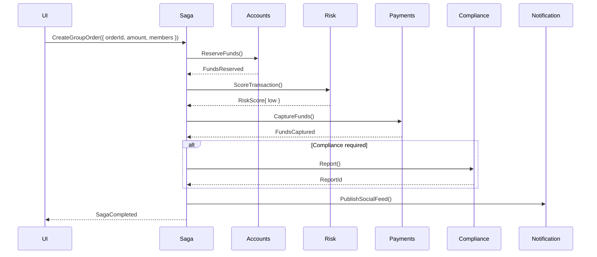

```markdown
<!--
  File: paypalsphere/docs/patterns/saga-pattern.md
  Description: Internal engineering playbook entry that documents how the
               Saga Pattern is applied across the PayPalsphere platform.
  Audience   : Backend & Frontend engineers, SRE, Security
-->

# Saga Pattern @ PayPalsphere  
Coordinating Long-Running, Distributed, Social Payments

> TL;DR  
> • Each “social payment” (group split, fundraiser, multi-legged settlement) is a _Saga_.  
> • A Saga is a sequence of domain commands dispatched to multiple bounded contexts, tied together with deterministic compensations.  
> • Orchestration is preferable to choreography for cross-context consistency, observability and granular security controls.  
> • The Saga Orchestrator is an **Applicative Service** that lives _outside_ of core domains and is _stateless_ (all state is Event-Sourced).  

---

## 1. Context & Motivation
A single PayPalsphere interaction can trigger:

1. Identity verification (KYC)
2. Real-time risk scoring
3. FX conversion
4. Compliance reporting
5. Payment capture & settlement
6. Social-graph notifications

Any of the above can fail or time-out. Undoing partial work must be deterministic,
auditable and secure. Traditional ACID transactions are impossible across
micro-services; hence we apply the Saga Pattern.

---

## 2. Orchestration vs. Choreography

|                               | Orchestration (our choice) | Choreography |
|-------------------------------|----------------------------|--------------|
| Open telemetry / tracing      | Centralized               | Distributed  |
| Policy enforcement (RBAC, GDPR)| Single checkpoint         | Scattered    |
| Compensation logic            | Declarative               | Emergent     |
| Cognitive load                | Lower                     | Higher       |

---

## 3. High-Level Flow (Group-Order Settlement)



---

## 4. Reference Implementation (TypeScript)

> NOTE: This code intentionally avoids framework-specific magic so it can be
> dropped into any Node.js runtime (NestJS, Fastify, Express, etc.).

### 4.1 Domain Events & Commands

```ts
// src/contracts/kyc.ts
export interface ReserveFunds {
  type: 'ReserveFunds';
  data: { accountId: string; amount: number; correlationId: string };
}

export interface FundsReserved {
  type: 'FundsReserved';
  data: { reservationId: string; correlationId: string };
}

export type AccountsCommand = ReserveFunds;
export type AccountsEvent = FundsReserved;

// Similar files exist per bounded context: risk.ts, payments.ts, etc.
```

### 4.2 The Saga Definition

```ts
// src/sagas/GroupOrderSaga.ts
import { v4 as uuid } from 'uuid';
import {
  ReserveFunds,
  FundsReserved
} from '../contracts/kyc';
import { ScoreTransaction, TransactionScored } from '../contracts/risk';
import { CaptureFunds, FundsCaptured } from '../contracts/payments';
import { ReportTxn, TxnReported } from '../contracts/compliance';
import { Saga, Step } from './framework/Saga';

export interface GroupOrderPayload {
  orderId: string;
  amount: number;
  members: string[];
  currency: string;
}

export class GroupOrderSaga extends Saga<GroupOrderPayload> {
  definition = [
    new Step<ReserveFunds, FundsReserved>({
      invoke: payload => ({
        type: 'ReserveFunds',
        data: {
          accountId: payload.members[0],          // simplification
          amount: payload.amount,
          correlationId: this.id,
        },
      }),
      compensate: reservation => ({
        type: 'ReleaseReservation',
        data: { reservationId: reservation.data.reservationId },
      }),
    }),

    new Step<ScoreTransaction, TransactionScored>({
      invoke: payload => ({
        type: 'ScoreTransaction',
        data: { orderId: payload.orderId, correlationId: this.id },
      }),
      onFailure: 'ABORT', // no compensation needed; funds were never captured
    }),

    new Step<CaptureFunds, FundsCaptured>({
      invoke: payload => ({
        type: 'CaptureFunds',
        data: { reservationId: this.state['FundsReserved'].data.reservationId },
      }),
      compensate: capture => ({
        type: 'RefundFunds',
        data: { paymentId: capture.data.paymentId },
      }),
    }),

    new Step<ReportTxn, TxnReported>({
      invoke: payload => ({
        type: 'ReportTxn',
        data: { orderId: payload.orderId, amount: payload.amount },
      }),
      optional: true, // only executed if jurisdiction requires
    }),
  ];
}
```

### 4.3 Minimal Saga Framework

```ts
// src/sagas/framework/Saga.ts
import { EventEmitter } from 'events';

/**
 * Typed representation of a compensation or next-command builder.
 */
export type CommandBuilder<TPayload, TCommand> = (
  payload: TPayload,
  saga: Saga<TPayload>
) => TCommand;

/**
 * Simple step abstraction.
 */
export class Step<TCommand, TSuccessEvent> {
  constructor(
    readonly cfg: {
      invoke: CommandBuilder<any, TCommand>;
      compensate?: (successEvt: TSuccessEvent) => TCommand;
      onFailure?: 'ABORT' | 'CONTINUE';
      optional?: boolean;
    },
  ) {}
}

/**
 * Base Saga orchestrator.
 * Stores intermediate events in `state`, enabling later steps to reference them.
 */
export abstract class Saga<TPayload> extends EventEmitter {
  public readonly id = uuid();
  protected state: Record<string, any> = {};

  abstract definition: Step<any, any>[];

  async execute(payload: TPayload): Promise<void> {
    for (const step of this.definition) {
      const command = step.cfg.invoke(payload, this);
      try {
        const successEvt = await this.dispatch(command);
        this.state[successEvt.type] = successEvt;
      } catch (err) {
        if (step.cfg.compensate) {
          await this.dispatch(step.cfg.compensate(this.state[command.type]));
        }
        if (step.cfg.onFailure === 'ABORT') throw err;
      }
    }
  }

  /**
   * Dispatches a command to its bounded context via the internal event bus.
   * This is a **blocking** call for demo purposes. In production, we’d use
   * NATS Streaming or Apache Kafka and persist the Saga state between messages.
   */
  private async dispatch(command: any): Promise<any> {
    return new Promise((resolve, reject) => {
      const correlationId = command.data?.correlationId || this.id;
      this.emit('command', { ...command, correlationId }, resolve, reject);
    });
  }
}
```

### 4.4 Wiring Up Bounded Context Handlers

```ts
// src/index.ts
import { GroupOrderSaga } from './sagas/GroupOrderSaga';
import { AccountsService } from './services/AccountsService';
import { RiskService } from './services/RiskService';
import { PaymentsService } from './services/PaymentsService';
import { ComplianceService } from './services/ComplianceService';

const saga = new GroupOrderSaga();

const handlers = [
  new AccountsService(),
  new RiskService(),
  new PaymentsService(),
  new ComplianceService()
];

// Listen to commands
handlers.forEach(h =>
  saga.on('command', h.handle.bind(h)),
);

// Execute a saga
saga.execute({
  orderId: 'ORD_123',
  amount: 900,
  members: ['USR_1', 'USR_2', 'USR_3'],
  currency: 'USD',
});
```

---

## 5. Guarantees

1. **Exactly-Once Intent**  
   Commands carry a deterministic `correlationId`. Consumers use it to ensure idempotency.

2. **Auditable Replay**  
   All commands & events are persisted to the Event Store. Replaying them can reconstruct
   Saga state or power the social “re-live” feature.

3. **End-to-End Encryption**  
   Sensitive payload fields (PII, payment data) are selectively encrypted using
   our `@paypalsphere/crypto` field-level utilities.

4. **Observability**  
   OpenTelemetry spans are generated for each step and streamed to Grafana Tempo.

---

## 6. Failure & Compensation Matrix

| Step                | Failure Mode             | Compensation                 |
|---------------------|--------------------------|------------------------------|
| ReserveFunds        | Insufficient Balance     | Abort saga, notify members   |
| ScoreTransaction    | High Risk                | Release Funds reservation    |
| CaptureFunds        | Gateway Timeout / Decline| Refund reservation           |
| ReportTxn (optional)| Regulatory Service Down  | Deferred retry queue         |

---

## 7. Security Considerations

• Each command verifies the caller’s JWT claims and circle-level ACLs via our
  `@paypalsphere/authz` policy engine.  
• Compensations _must_ be as privileged as their forward commands (principle of least privilege).  
• All Saga definitons undergo automatic threat modeling with *OWASP Threat Dragon* in CI.

---

## 8. Checklist (pre-merge)

- [ ] New Saga registered in `config/saga-registry.yml`
- [ ] ADR updated if boundaries changed
- [ ] Security review approved
- [ ] e2e contract tests passing
- [ ] Grafana dashboard updated with new span name

---

> © PayPalsphere Engineering
> _Turning payments into conversations, safely._
```