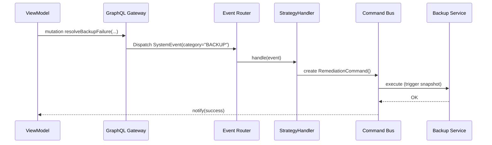

```markdown
# ProdSecure Orchestrator – Architecture & Design Guide
> _Document ID: PSO-DOC-03_  
> _Revision: 1.4_     
> _Last updated: <?php echo date('Y-m-d'); ?>_

---

## 1. High-Level Architecture

```mermaid
graph TD
    subgraph Front-End (MVVM)
        UI[UI Widgets] --> VM[ViewModel]
    end
    subgraph Application Server
        VM -->|Query / Cmd| API[GraphQL Gateway]
        API --> Router[Event Router (Chain of Responsibility)]
        Router -->|dispatch| Strategy[Strategy Handlers]
        Router -->|fallback| Bus[Command Bus]
    end
    subgraph Service Mesh
        Strategy -->|call| SVC[Security Micro-Services]
        Bus -->|exec| SVC
        SVC --- Telemetry[Telemetry Stream (Observer)]
    end
    Telemetry --> VM
```

*The diagram illustrates how each pattern—MVVM, Chain of Responsibility, Strategy, Command, Observer, and Service Mesh—interacts in real time.*

---

## 2. Core Design Principles
1. **Pure MVVM** – All view state is stored exclusively in reactive ViewModels.  
2. **Service Mesh** – Every micro-service is registered in a side-car Envoy instance and discovered via xDS.  
3. **Event-Driven** – All critical system events travel through a single, type-safe pipeline.  
4. **Pluggable Strategies** – Security logic can be swapped at runtime without downtime.  
5. **Idempotent Commands** – Remediation routines are replay-safe and fully audit-logged.  

---

## 3. Module Breakdown

### 3.1 Event Router (Chain of Responsibility)

```php
<?php
declare(strict_types=1);

namespace ProdSecureOrchestrator\Pipeline;

use Psr\Log\LoggerInterface;
use Throwable;

/**
 * Interface EventHandler
 * Each concrete handler decides if it can process the incoming event;
 * otherwise, it forwards it to the next handler in the chain.
 */
interface EventHandler
{
    public function setNext(?EventHandler $handler): void;
    public function handle(SystemEvent $event): void;
}

/**
 * Base handler implementing the boiler-plate chain mechanics.
 */
abstract class AbstractHandler implements EventHandler
{
    protected ?EventHandler $next = null;
    protected LoggerInterface $logger;

    public function __construct(LoggerInterface $logger)
    {
        $this->logger = $logger;
    }

    public function setNext(?EventHandler $handler): void
    {
        $this->next = $handler;
    }

    public function handle(SystemEvent $event): void
    {
        if ($this->supports($event)) {
            $this->process($event);
        } elseif ($this->next) {
            $this->next->handle($event);
        } else {
            $this->logger->warning('No handler found for event: '.$event->type());
        }
    }

    /**
     * Determines whether this handler will process the event.
     */
    abstract protected function supports(SystemEvent $event): bool;

    /**
     * Handler-specific processing logic.
     */
    abstract protected function process(SystemEvent $event): void;
}

/**
 * Concrete handler for intrusion detection alerts.
 */
final class IntrusionHandler extends AbstractHandler
{
    protected function supports(SystemEvent $event): bool
    {
        return $event->category() === 'IDS';
    }

    protected function process(SystemEvent $event): void
    {
        // run strategy
        try {
            $strategy = StrategyFactory::for($event);
            $strategy->execute();
            $this->logger->info('Intrusion event processed', ['id' => $event->id()]);
        } catch (Throwable $e) {
            $this->logger->error('Failed to process intrusion event', ['exception' => $e]);
            throw $e; // bubble up for centralized error handler
        }
    }
}

// Router Builder
$router = new IntrusionHandler($logger);
$router->setNext(new BackupFailureHandler($logger));
$router->setNext(new PerformanceDegradationHandler($logger));
// the resulting $router is injected into the GraphQL resolver
```

### 3.2 Strategy Pattern

```php
<?php
namespace ProdSecureOrchestrator\Strategy;

interface MitigationStrategy
{
    public function execute(): void;
}

final class QuarantineHost implements MitigationStrategy
{
    public function execute(): void
    {
        // Call out to service-mesh side-car → `security-isolation` service
        ServiceMesh::invoke('security-isolation', '/quarantine', ['hostname' => gethostname()]);
    }
}

final class ThrottleTraffic implements MitigationStrategy
{
    public function execute(): void
    {
        ServiceMesh::invoke('traffic-controller', '/throttle', ['limit' => '500kbps']);
    }
}

final class StrategyFactory
{
    public static function for(SystemEvent $event): MitigationStrategy
    {
        return match (true) {
            $event->severity() >= SystemEvent::CRITICAL => new QuarantineHost(),
            default                                     => new ThrottleTraffic(),
        };
    }
}
```

### 3.3 Observer Pattern – Real-Time Telemetry

```php
<?php
namespace ProdSecureOrchestrator\Telemetry;

use SplSubject;
use SplObserver;

trait MetricSubject
{
    /** @var SplObserver[]  */
    private array $observers = [];

    public function attach(SplObserver $observer): void
    {
        $this->observers[] = $observer;
    }

    public function detach(SplObserver $observer): void
    {
        $this->observers = array_filter(
            $this->observers,
            static fn ($o) => $o !== $observer
        );
    }

    protected function notifyObservers(): void
    {
        foreach ($this->observers as $observer) {
            $observer->update($this);
        }
    }
}

final class CpuMetricStream implements SplSubject
{
    use MetricSubject;

    private float $usage = 0.0;

    public function tick(float $newUsage): void
    {
        $this->usage = $newUsage;
        $this->notifyObservers();
    }

    public function getUsage(): float
    {
        return $this->usage;
    }
}

final class HeatmapWidget implements SplObserver
{
    public function update(SplSubject $subject): void
    {
        if ($subject instanceof CpuMetricStream) {
            WebSocket::broadcast('cpuHeatmap', [
                'hostname' => gethostname(),
                'usage'    => $subject->getUsage(),
            ]);
        }
    }
}
```

### 3.4 Command Pattern – Automated Remediation

```php
<?php
namespace ProdSecureOrchestrator\Command;

interface RemediationCommand
{
    public function execute(): void;
    public function rollback(): void;
}

final class RestartServiceCommand implements RemediationCommand
{
    public function __construct(
        private string $serviceName,
        private AuditLogger $audit
    ) {}

    public function execute(): void
    {
        $this->audit->log('Restarting '.$this->serviceName);
        ServiceMesh::invoke('orchestrator', '/restart', ['service' => $this->serviceName]);
    }

    public function rollback(): void
    {
        $this->audit->log('Undo restart '.$this->serviceName);
        // Maybe nothing to rollback, maybe scale out or mark degraded
    }
}

final class CommandBus
{
    /** @param RemediationCommand[] $queue */
    public function __construct(private array $queue = []) {}

    public function add(RemediationCommand $command): void
    {
        $this->queue[] = $command;
    }

    public function run(): void
    {
        foreach ($this->queue as $cmd) {
            try {
                $cmd->execute();
            } catch (Throwable $e) {
                $cmd->rollback();
                throw $e;
            }
        }
    }
}
```

---

## 4. Service Mesh Integration

All inter-service calls use a thin abstraction layer (`ProdSecureOrchestrator\Infrastructure\ServiceMesh`) that wraps  
gRPC, mTLS, automatic retries, and circuit-breaking via [OpenTelemetry](https://opentelemetry.io/).

```php
<?php
final class ServiceMesh
{
    public static function invoke(string $service, string $endpoint, array $payload = []): array
    {
        // Pseudo-code: In production this would be a gRPC client
        $url = "http://{$service}.mesh.local{$endpoint}";
        $response = Http::post($url, $payload)
            ->retry(3, 250)
            ->throw()        // throws HttpException on non-2xx
            ->json();
        return $response;
    }
}
```

---

## 5. Resilience & Error Handling

* **Centralized Logger:** Monolog + Sentry DSN  
* **Graceful Shutdown:** Symfony Runtime’s `SignalHandler` / pcntl  
* **Circuit Breaker:** 3 failures ⇒ 60 s cool-off via `php-hystrix`  
* **Idempotency Key:** SHA-1(uuid + payload) header prevents duplicate commands  

---

## 6. Sequence Diagram – Handling a Backup Failure



---

## 7. Extending the Platform

1. **Add a new micro-service**  
   • Register it in the Service Mesh side-car manifest `(mesh.yaml)`  
   • Tag endpoints with `x-permissions` for RBAC.

2. **Introduce a new Strategy**  
   • Implement `MitigationStrategy`  
   • Append rule in `StrategyFactory::for()`.

3. **Custom View Widget**  
   • Subscribe to `MetricSubject` streams via GraphQL WebSocket.  
   • Render using Vue 3 + Composition API (or React, both supported).

---

## 8. Configuration Schema

```yaml
# config/prodsecure.yaml
orchestrator:
  logging:
    level: INFO
    sink:  tcp://splunk-collector.mesh.local:5050
  service_mesh:
    retry_policy:
      max_attempts: 3
      per_try_timeout_ms: 250
  pipelines:
    - name: default
      handlers:
        - IntrusionHandler
        - BackupFailureHandler
        - PerformanceDegradationHandler
  commands:
    timeout: 90s
```

---

© 2024 ProdSecure, Inc. All rights reserved.
```