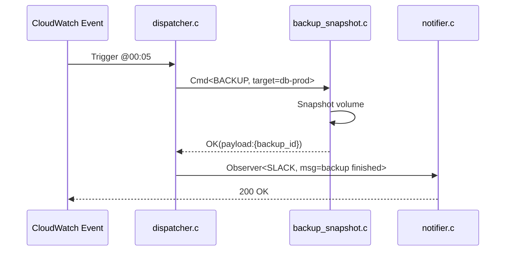

# LambdaUtility Orchestrator – Architecture Guide
*File `LambdaUtilityOrchestrator/docs/ARCHITECTURE.md`*  
*Revision 1.0 – generated automatically, keep under version-control*

---

## 1  Overview
LambdaUtility Orchestrator (LUO) is a **serverless, event-driven automation framework written in ISO C17**.  
It decomposes day-to-day systems-administration chores into *single-purpose* functions that are:

* **Stateless** – no mutable global state, all context travels with the event.
* **Isolated** – each task compiles to an independent, share-nothing artifact.
* **Composable** – tasks are assembled at runtime through Command & Chain-of-Responsibility (CoR) objects.
* **Cost-efficient** – resources are allocated only for the invocation window.

The project therefore balances the raw speed of C with the operational model of Functions-as-a-Service (FaaS).

---

## 2  Guiding Principles
1. **Small Binaries** – strip, `-ffunction-sections`, link-time optimisation.  
2. **No Heap by Default** – prefer stack allocation; `malloc()` guarded behind compile-time flag.  
3. **Fail Fast & Observable** – every error path emits a structured log entry.  
4. **Deterministic Builds** – *CMake + Conan* produce reproducible artefacts.  
5. **Zero Hidden I/O** – all file/network I/O is explicit and wrapped in timeout-aware adapters.

---

## 3  High-Level Architecture
```
+----------------------+
| Event Source (SQS)   |     ┌───────────────────────────────────────────────┐
+----------+-----------+     │01. Dispatcher Lambda                         │
           |                 │   - Parses trigger                            │
           |  JSON event     │   - Maps to Command object                    │
           v                 └───────────┬───────────────────────────────────┘
+----------------------+                (Command*)
| Event Schema v3      |<───────────┐
+----------------------+            │
                                    v
                         ┌─────────────────────────┐
                         │02. Processor Lambda(s)  │  fan-out (CoR)
                         ├─────────────────────────┤
                         │* config_push.c          │
                         │* backup_snapshot.c      │
                         │* deploy_rollout.c       │
                         └───────────┬────────────┘
                                     │ Observer events
                                     v
                         ┌─────────────────────────┐
                         │03. Notifier Lambda      │
                         │   (Slack/Email/SMS)     │
                         └─────────────────────────┘
```

All functions produce logs to **CloudWatch** and metrics to **Prometheus Pushgateway** via a lightweight UDP side-channel.

---

## 4  Runtime Flow Example – “Nightly Backup”


---

## 5  Module Breakdown

| Module                      | Responsibility | Key Files |
|-----------------------------|----------------|-----------|
| `src/common/`               | Foundation – logging, JSON, URI parser, runtime guardrails | `log.h`, `json.h`, `panic.h` |
| `src/dispatcher/`           | Convert triggers to Commands | `dispatcher.c`, `command_factory.c` |
| `src/commands/`             | Discrete unit of work | `config_push.c`, `backup_snapshot.c`, `deploy_rollout.c` |
| `src/cor/`                  | Chain-of-Responsibility framework | `chain.h`, `chain.c` |
| `src/observer/`             | Outbound notifications | `observer.c`, `sink_slack.c`, `sink_email.c` |
| `src/adapters/`             | Cloud vendor integration | `s3_adapter.c`, `kms_adapter.c` |
| `tests/`                    | µ-unit tests (Unity) | `test_log.c`, `test_dispatcher.c` |

---

## 6  Key Design Patterns

### 6.1  Command Pattern
```c
// command.h
#pragma once
#include <stdbool.h>
typedef struct luo_ctx luo_ctx_t;
typedef struct luo_cmd {
    const char         *name;
    bool (*exec)(luo_ctx_t *ctx, const char *payload);
    void (*destroy)(struct luo_cmd *);
} luo_cmd_t;
```

### 6.2  Chain-of-Responsibility
```c
// chain.h
#pragma once
#include "command.h"
typedef struct chain_node {
    luo_cmd_t          *cmd;
    struct chain_node  *next;
} chain_node_t;

bool chain_handle(chain_node_t *head, luo_ctx_t *ctx, const char *payload);
```

### 6.3  Observer Pattern
```c
// observer.h
#pragma once
typedef struct observer {
    void (*notify)(const char *msg, void *user_data);
    void *user_data;
} observer_t;

void observer_emit(const char *msg);
void observer_subscribe(observer_t obs);
```

Observers are registered during cold-start and executed asynchronously to keep the hot path latency low.

---

## 7  Data Contracts & Event Schema

```jsonc
// Event v3 – any new field MUST be feature-gated
{
  "meta": {
    "version": 3,
    "trace_id": "c3b0a1b2...",
    "timestamp": "2024-10-01T00:05:00Z"
  },
  "trigger": {
    "type": "CRON",
    "source": "cron/nightly-backup"
  },
  "command": {
    "name": "BACKUP_SNAPSHOT",
    "params": {
      "volume_id": "vol-0420",
      "retention_days": 7
    }
  }
}
```
Validation is executed via `json_schema_validate()` at the dispatcher.

---

## 8  Error Handling & Retries
1. **Within Lambda invocation**  
   * Return `bool ok` from every command; on `false`, bubble up with `luo_err_t` (enum).  
2. **Transient failures** (`LUO_ERR_IO`, `LUO_ERR_TIMEOUT`)  
   * Re-queued by platform w/ exponential back-off (dead-letter after 5 tries).  
3. **Permanent failures** (`LUO_ERR_BAD_INPUT`)  
   * Short-circuit CoR, emit `ERROR` observer event only.  
4. **Crash (SIGSEGV, abort)**  
   * Handled by `panic.c` to log register dump, trace-id, and memory usage before exit.

---

## 9  Concurrency & Memory Footprint
* **Default memory**: 128 MiB, **max runtime**: 30 s.  
* Commands must complete within 25 s to leave buffer for observers.  
* No global `printf()` – use `log_info()` which writes into thread-local ring-buffer flushed at end.  
* Bounded parallelism in each function using *work-stealing pool* (2×vCPU) guarded by `sem_t`.

---

## 10  Build, Packaging & Deployment
```bash
# deterministic build
$ cmake -S . -B build -DCMAKE_BUILD_TYPE=Release -DUSE_LTO=ON
$ cmake --build build --target package
# artefact: dist/luo_dispatcher.zip
```
CI pipeline (GitHub Actions) performs:

1. **Static Analysis** – `clang-tidy`, `cppcheck`, `include-what-you-use`.  
2. **Unit Tests** – run with `ctest` (Unity).  
3. **Integration Tests** – localstack for AWS APIs.  
4. **Signing** – SHA-256 + Sigstore.  
5. **Deploy** – `aws lambda update-function-code`.

---

## 11  Security Considerations
* **Principle of Least Privilege** – each Lambda has its own IAM role with scoped-down actions.  
* **Secrets** – pulled at runtime from AWS KMS, decrypted in-memory only.  
* **In-Transit Encryption** – TLS 1.3 for all egress; linked with *mbedTLS*.  
* **Supply-chain** – only pin checked-in `conan.lock`. No dynamic downloads during build.

---

## 12  Operational Excellence
* **Observability**  
  * OpenTelemetry exporter inside `log.c`.  
  * Prom metrics: `luo_cmd_latency_seconds`, `luo_invocations_total`, `luo_errors_total`.  
* **Blue/Green Deployment** – traffic shift via Lambda Aliases.  
* **Runbook** – live in `docs/runbook.md`.  
* **SLOs** – 99.9 % success rate & p95 < 1 s for dispatcher.

---

## 13  Future Work
* **WebAssembly Runtime** to sandbox 3rd-party extension commands.  
* **Edge-executed Observers** (CloudFront Functions) for ultra-low latency alerts.  
* **gRPC over HTTP/2** between chained commands to stream large payloads.

---

## 14  Appendix A – Minimal Lambda Entry Point (C)
```c
// lambda_entry.c
#include "aws_lambda_runtime.h"   // AWS provided
#include "dispatcher.h"

int main(void)
{
    /* Initialize common singletons */
    if (!luo_runtime_init()) {
        return LUO_EXIT_INIT_FAIL;
    }

    /* Run AWS event loop */
    return aws_lambda_runtime_start(dispatcher_handler);
}
```

---

## 15  Document Conventions
* **`monospace`** – code identifiers.  
* `_italic_` – external components.  
* **Bold** – emphasis.  
Diagram tooling: *mermaid.js*; keep diagrams within 80 cols.

---

© 2024 LambdaUtility Orchestrator Project – MIT License  
Contributions welcome.