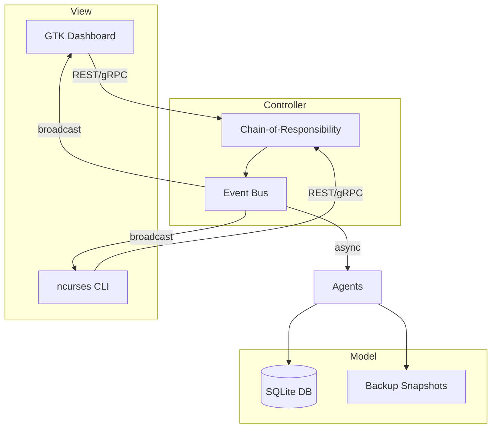

```markdown
# CampusGuard EDU Monitor (system_monitoring)
[](https://github.com/uni-labs/CampusGuard-EDU-Monitor/actions)
[](LICENSE)
[](https://coveralls.io/github/uni-labs/CampusGuard-EDU-Monitor?branch=main)

CampusGuard EDU Monitor is an open-source, **C-based system-monitoring and DevSecOps teaching suite** tailored for university Computer-Science curricula.  
It embodies real-world patterns—Observer, Chain-of-Responsibility, Event-Driven messaging, and a Service-Mesh of micro-agents—while staying small enough for students to read, extend, and hack.

---

## ✨ Key Features

* **Real-time System Metrics** – CPU, Memory, I/O, and Network charts rendered via GTK or ncurses dashboards.  
* **Centralized Log Aggregation** – Structured logs streamed to SQLite and optionally exported to ELK.  
* **Integrated Security Scanning** – Pluggable vulnerability and CIS checks with auto-patch suggestions.  
* **Backup & Disaster-Recovery** – Incremental snapshots, encrypted archives, and drill simulations.  
* **Automated Deployments** – GitOps-style manifests, rolling updates, and canary analysis.  
* **Pluggable Alerting** – Route alerts to Email, Slack, or PagerDuty connectors.  

---

## 📦 Repository Layout

```
CampusGuard-EDU-Monitor/
├── docs/               ← Markdown, diagrams, teaching guides
│   └── README.md       ← (you are here)
├── src/                ← Production C code
│   ├── core/           ← Observer/event bus, models, controllers
│   ├── ui/             ← GTK & ncurses front-ends
│   └── agents/         ← Micro-agents for service-mesh simulation
├── tests/              ← Unit & integration tests (C + Bats)
└── cmake/              ← CMake tool-chain & Find*.cmake helpers
```

---

## 🚀 Quick Start

### 1. Prerequisites

* GCC 11+ or Clang 14+  
* CMake 3.20+  
* SQLite 3.35+  
* GTK 3.24+ (optional, for GUI)  
* ncurses 6.2+ (optional, for TUI)  

Ubuntu/Debian:

```bash
sudo apt update
sudo apt install build-essential cmake libgtk-3-dev libncurses-dev sqlite3 libsqlite3-dev
```

### 2. Build & Run

```bash
git clone https://github.com/uni-labs/CampusGuard-EDU-Monitor.git
cd CampusGuard-EDU-Monitor
cmake -B build -DCMAKE_BUILD_TYPE=Release
cmake --build build -j$(nproc)
./build/bin/cguard --help
```

### 3. Service-Mesh Lab VM Deployment

```bash
./scripts/deploy_lab.sh --nodes 5          # spins up 5 LXC containers
./scripts/drills/start_disaster_drill.sh   # simulate DR, observe event bus
```

---

## 🧑‍💻 Code Example

The snippet below shows how `src/core/observer.c` registers a metric probe and emits events through the central bus.

```c
/* src/core/observer.c */
#include "cguard/event_bus.h"
#include "cguard/probes/cpu_probe.h"

static void on_tick(void *ctx)
{
    cg_metric_t metric = cg_cpu_probe_read();
    cg_event_publish(EV_METRIC_CPU, &metric, sizeof(metric));
}

void cg_observer_init(void)
{
    cg_event_bus_subscribe(EV_TICK_1S, on_tick, NULL);
}
```

And in a Controller:

```c
/* src/core/controller/scan_ctrl.c */
#include "cguard/event_bus.h"
#include "cguard/chain/acl_handler.h"
#include "cguard/scanner/vuln_scan.h"

static int handle_scan_request(const cg_request_t *req)
{
    /* ACL handler ensures the caller has SCAN permission */
    if (!cg_acl_check(req->uid, PERM_SCAN))
        return CG_ERR_PERMISSION_DENIED;

    return cg_vuln_scan_enqueue(req->target);
}

CG_CHAIN_REGISTER("scan-request", handle_scan_request);
```

---

## 🏛 Architecture Overview



---

## 🔒 Security Practice Highlights

* Compile-time **`-D_FORTIFY_SOURCE=2`** and **`-fsanitize=address,undefined`** flags.  
* Strict **`clang-tidy`** and **`cppcheck`** CI gates.  
* All network traffic TLS-encrypted with mutual authentication certificates stored in **HashiCorp Vault**.  
* Agents run inside **seccomp** and **AppArmor** sandboxes by default.

---

## 📚 Teaching Modules

| Module                      | Sub-topics                                | Folder          |
|-----------------------------|-------------------------------------------|-----------------|
| 01 Intro to Monitoring      | Metrics, Logs, Traces                     | docs/modules/01 |
| 02 Design Patterns          | MVC, Observer, CoR, Event-Driven          | docs/modules/02 |
| 03 Security Scanning        | CVEs, SBOM, Vulnerability Databases       | docs/modules/03 |
| 04 Backup & DR              | Snapshots, Disaster Drills, Restore Flow  | docs/modules/04 |
| 05 DevSecOps Pipelines      | GitOps, CI/CD, Canary Releases            | docs/modules/05 |

---

## 🛠️ Contributing

1. Fork and create a branch (`git checkout -b feature/my-awesome`).
2. Follow the code style (`clang-format -i $(git ls-files '*.c' '*.h')`).
3. Make sure `./scripts/run_tests.sh` passes **before** pushing.
4. Open a Pull Request and describe **why** the change matters for teaching.  

All contributors must sign the **Contributor License Agreement** (CLA).

---

## 📜 License

CampusGuard EDU Monitor is released under the MIT License.  
See the [LICENSE](../LICENSE) file for full text.

---

## 🙏 Acknowledgements

Built with ❤️ by the Uni-Labs Teaching-Tools Group.  
Special thanks to contributors from the Spring 2023 *CIS-489 Systems Engineering* cohort.
```