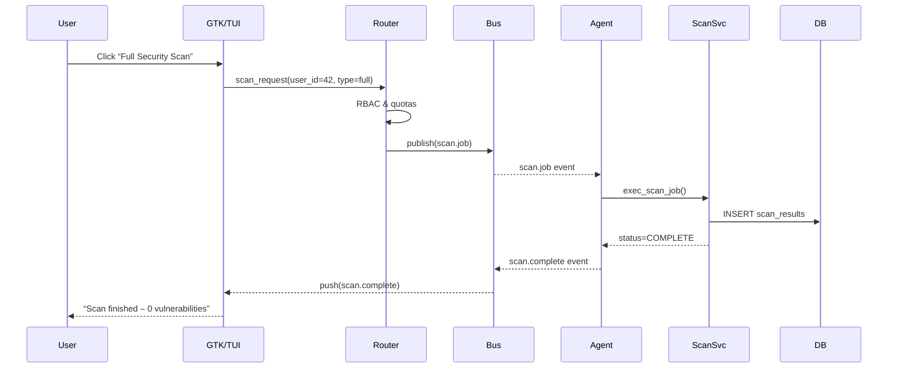

```markdown
# CampusGuard EDU Monitor – Architecture Overview
*Version 1.1 – Generated: 2024-06-11*

> “A monitoring suite that doubles as a classroom.”  
> — CampusGuard EDU Core Team


## 1  Executive Summary
CampusGuard EDU Monitor is a modular, C-based system-monitoring platform purpose-built for university computer-science curricula.  
The codebase is intentionally “open-book”, exposing real-world design patterns (MVC, Observer, Chain of Responsibility, Event Driven, and Service Mesh techniques) without sacrificing production robustness.  
Students interact with the **View** layer (GTK/ncurses dashboard) while the **Controller** layer orchestrates tasks across a simulated micro-agent **Service Mesh**.  
Data persistence, analytics, and REST exposure reside in the **Model** layer.

---

## 2  High-Level Component Map

```mermaid
graph TD
    subgraph View Layer
        UI_GTK[GTK Dashboard]
        UI_TUI[ncurses TUI]
    end

    subgraph Controller Layer
        CmdRouter[Command Router<br>(Chain of Responsibility)]
        EventBus[Event Bus<br>(libev + ZeroMQ)]
    end

    subgraph Service Mesh
        Agent[Micro-Agent<br>(libmicrohttpd)]
        ScanSvc[Security Scan Service]
        LogSvc[Log Aggregation Service]
        BkpSvc[Backup / Recovery Service]
        AlertSvc[Alert Rule Engine]
    end

    subgraph Model Layer
        DB[(SQLite DB)]
        FileBlob[[Blob Store<br>/var/lib/cg-snapshots]]
        REST[Internal REST API]
    end

    UI_GTK -->|Observer| CmdRouter
    UI_TUI -->|Observer| CmdRouter
    CmdRouter --> EventBus
    EventBus --> Agent
    Agent --> ScanSvc
    Agent --> LogSvc
    Agent --> BkpSvc
    Agent --> AlertSvc
    ScanSvc --> DB
    LogSvc --> DB
    BkpSvc --> FileBlob
    AlertSvc --> DB
    REST -->|HTTP/JSON| View Layer
```

Legend:  
• **Solid arrows** indicate synchronous calls.  
• **Dashed arrows** (omitted for clarity) represent asynchronous event notifications.


---

## 3  Module Breakdown

| Layer | C Library | Description | Key Patterns |
|-------|-----------|-------------|--------------|
| View  | `gtk/gtk.h`, `ncurses.h` | Real-time dashboards, forms, and historical charts. | Observer |
| Controller | `controller/router.h` | Validates requests, enforces RBAC, and constructs events. | Chain of Responsibility |
| Event Bus | `libev`, `zmq.h` | Non-blocking I/O loop; pub/sub message distribution. | Event Driven |
| Service Mesh | `agent/` | Lightweight HTTP agents hosting pluggable services. | Micro-services |
| Model | `sqlite3.h`, custom ORM | Persists logs, scans, snapshots. | Active Record |
| Utils | `logging.h`, `cfg.h`, `metrics.h` | Facilities shared across layers. | – |

---

## 4  Runtime Sequence (Typical “Run Security Scan”)



---

## 5  Source Tree (abridged)

```
CampusGuard-EDU-Monitor/
├── src/
│   ├── controller/
│   │   ├── router.c
│   │   └── router.h
│   ├── agent/
│   │   ├── agent_main.c
│   │   └── plugins/
│   │       ├── scan.c
│   │       ├── log.c
│   │       └── backup.c
│   ├── model/
│   │   ├── orm.c
│   │   └── orm.h
│   ├── utils/
│   │   ├── logging.c
│   │   ├── logging.h
│   │   └── cfg.h
│   └── view/
│       ├── gtk_view.c
│       └── tui_view.c
└── docs/
    └── design/
        └── 01_Architecture_Overview.md   ← you are here
```

---

## 6  Data Model Snapshot

```
Table: logs
+-------------+----------+--------------------------+
| id (PK)     | INTEGER  | auto-increment           |
| level       | TEXT     | INFO/WARN/ERROR          |
| message     | TEXT     | log payload              |
| created_at  | DATETIME | default CURRENT_TIMESTAMP|
+-------------+----------+--------------------------+

Table: scans
+-------------+----------+--------------------------+
| id (PK)     | INTEGER  | auto-increment           |
| host        | TEXT     | target VM/FQDN           |
| summary     | TEXT     | “0 vulnerabilities”      |
| started_at  | DATETIME |                          |
| finished_at | DATETIME |                          |
+-------------+----------+--------------------------+
```

---

## 7  Configuration & Deployment

1. Build core libraries  
   ```bash
   mkdir build && cd build
   cmake .. -DCMAKE_BUILD_TYPE=Release
   make -j$(nproc)
   sudo make install
   ```
2. Configure agents (simulated mesh)  
   `/etc/cg-agent/agent.conf`:
   ```ini
   [agent]
   id = agent-01
   bind = tcp://0.0.0.0:5500
   plugins = scan,log,backup
   ```
3. Launch stack via systemd  
   ```bash
   sudo systemctl enable --now cg-bus cg-agent cg-ui
   ```
4. Point students to `http://localhost:8080` or run `cg-tui` in terminal.

---

## 8  Design Quality Highlights

• **Loose Coupling:** Event bus decouples UI from backend.  
• **Extensibility:** Agents load plug-ins at runtime via `dlopen(3)`.  
• **Testability:** Each layer exposes interfaces mocked by CMocka tests.  
• **Security:** Role-based access, prepared SQL statements, and SELinux policy stubs.  

---

## 9  Future Work

- Native Prometheus exporter  
- WASM-based sandbox to run student-written agents safely  
- IPv6 & TLS support for the message bus  

---

© 2024 CampusGuard EDU — MIT License
```