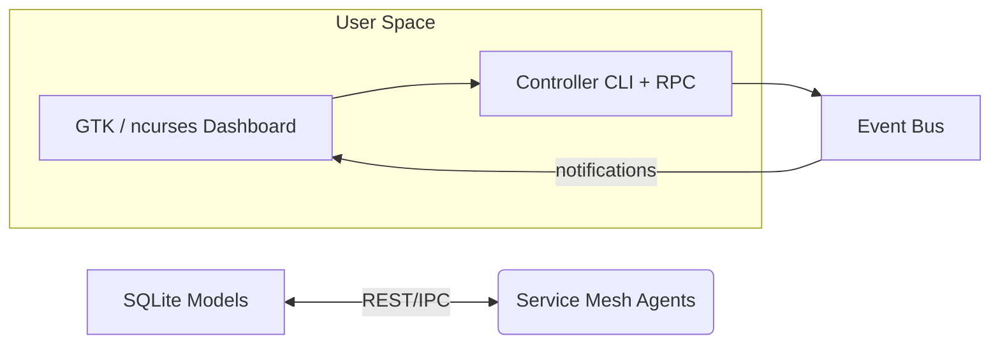
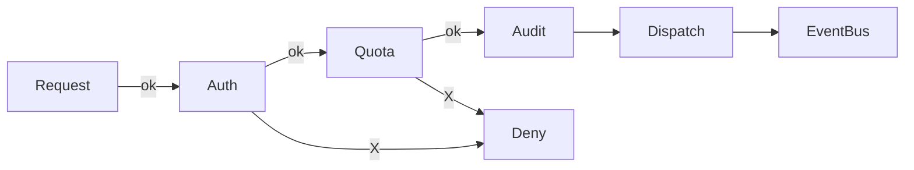

```markdown
<!--
  CampusGuard-EDU-Monitor ▸ docs ▸ design ▸ 02_Design_Patterns.md
  -----------------------------------------------------------------
  This document is version-controlled together with the source code
  in order to keep architectural decisions as close to the codebase
  as possible.  Please update this file whenever a new pattern is
  introduced or an existing design is refactored.
-->

# CampusGuard EDU Monitor  
## 02 – Design Patterns & Architectural Blueprint

> “Architecture starts where code ends.”  
> — _R. Tamblyn_

CampusGuard EDU Monitor is not _just_ a monitoring stack; it is a **teaching aid** that showcases how a professional-grade system would be built in **modern C**.  
To keep the codebase tidy and to offer students hands-on exposure to industry-proven blueprints, we explicitly incorporate the patterns documented below.

---

### Table of Contents
1. High-Level System Decomposition (MVC)
2. Behavioral Patterns  
   2.1 Observer Pattern (Metrics & Alert Bus)  
   2.2 Chain of Responsibility (User Command Pipeline)  
   2.3 Event-Driven Architecture (Job Dispatch)  
3. Structural Patterns  
   3.1 Proxy (Service Mesh Stubs)  
   3.2 Data Mapper (SQLite Model Gateways)  
4. Concurrency Primitives & Synchronisation
5. Error-Handling Philosophy
6. Extending / Overriding Patterns
7. References & Further Reading

---

## 1. High-Level System Decomposition (MVC)



• **Models** – reside in `src/model/`, each domain object (logs, snapshots, etc.) is isolated behind a **Data Mapper** that hides raw SQL.

• **Views** – located under `src/view/`, implemented twice:  
  – `gtk_view.c` for graphical labs  
  – `tui_view.c` for SSH-only sessions

• **Controllers** – orchestrate tasks through a **Chain of Responsibility** (see §2.2).  

All cross-component chatter happens via the **Event Bus** to minimise coupling.

---

## 2. Behavioral Patterns

### 2.1 Observer Pattern – Real-Time Metrics & Alert Bus

The Observer Pattern ensures that any module emitting telemetry does not care who is consuming it. The concrete implementation lives in `src/core/observer.c`.

```c
/* src/core/observer.c */
#include "observer.h"
#include <pthread.h>

static struct observer_node *registry = NULL;
static pthread_mutex_t       mtx      = PTHREAD_MUTEX_INITIALIZER;

void
cg_observer_register(cg_observer_cb cb, void *userdata)
{
        struct observer_node *n = calloc(1, sizeof(*n));
        if (!n) return;

        n->cb       = cb;
        n->userdata = userdata;

        pthread_mutex_lock(&mtx);
        SLIST_INSERT_HEAD(&registry, n, next);
        pthread_mutex_unlock(&mtx);
}

void
cg_observer_notify(const cg_event_t *ev)
{
        pthread_mutex_lock(&mtx);
        SLIST_FOREACH(struct observer_node *n, &registry, next) {
                n->cb(ev, n->userdata);
        }
        pthread_mutex_unlock(&mtx);
}
```

Key Points  
• Thread-safe via a **single mutex** because events are low-frequency; if throughput grows, we will replace this with an RCU list.  
• `cg_event_t` keeps payloads opaque so observers are _not_ recompiled when new fields appear.

---

### 2.2 Chain of Responsibility – User Command Pipeline

Every user request (GTK button click, REST POST, or CLI verb) becomes a `cg_cmd_t` object that flows through a pipeline of handlers:

1. `auth_handler` – verifies the session/role.
2. `quota_handler` – ensures the user has resources.
3. `audit_handler` – logs the intent.
4. `dispatch_handler` – puts the command onto the Event Bus.



```c
/* src/controller/cmd_pipeline.c */
static bool
auth_handler(struct cg_cmd *cmd) {
        if (!cg_acl_check(cmd->user, cmd->verb)) {
                cg_cmd_set_error(cmd, CG_E_FORBIDDEN, "ACL check failed");
                return false;
        }
        return true;
}

static bool
quota_handler(struct cg_cmd *cmd) {
        if (!cg_quota_check(cmd->user)) {
                cg_cmd_set_error(cmd, CG_E_QUOTA, "Quota exceeded");
                return false;
        }
        return true;
}

static bool
dispatch_handler(struct cg_cmd *cmd) {
        return cg_eventbus_publish(&cmd->ev);
}

static const cg_cmd_handler handlers[] = {
        auth_handler,
        quota_handler,
        audit_handler,
        dispatch_handler,
        NULL
};

bool
cg_cmd_execute(struct cg_cmd *cmd)
{
        for (size_t i = 0; handlers[i]; ++i) {
                if (!handlers[i](cmd))
                        return false;
        }
        return true;
}
```

---

### 2.3 Event-Driven Architecture – Dispatch & Job Workers

The **Event Bus** (file: `src/core/eventbus.c`) is an in-memory queue fed by `cg_cmd_execute`.  
Worker threads subscribe via **Observer** callbacks, enabling loose coupling between UI and heavy I/O operations (scans, backups).

Configuration snippet (`config/config.toml`):

```toml
[event_bus]
queue_depth   = 8192
worker_threads = 4
backoff_ms     = 250
```

---

## 3. Structural Patterns

| Pattern | Purpose | Location |
|---------|---------|----------|
| Proxy   | Hide network latency and retries between controllers and remote Service Mesh agents. | `src/mesh/proxy.c` |
| Data Mapper | Keep SQL out of business logic; compile-time checked queries. | `src/model/*.c` |

#### 3.1 Proxy Example

```c
/* src/mesh/proxy.c */
cg_status_t
mesh_request_backup(const char *vm_id)
{
        char url[128];
        snprintf(url, sizeof url, "http://agent-%s.local/backup", vm_id);

        for (int attempt = 0; attempt < 3; ++attempt) {
                cg_http_resp_t r = cg_http_post(url, NULL);
                if (r.status == 200)
                        return CG_OK;
                cg_sleep_ms(100 * attempt); /* exponential backoff */
        }
        return CG_E_REMOTE;
}
```

#### 3.2 Data Mapper Snippet

```c
/* src/model/log_mapper.c */
bool
log_mapper_insert(sqlite3 *db, const cg_log_entry *e)
{
        static const char *sql =
            "INSERT INTO logs(ts, level, message) VALUES(?, ?, ?)";
        sqlite3_stmt *st = NULL;

        if (sqlite3_prepare_v2(db, sql, -1, &st, NULL) != SQLITE_OK)
                return false;

        sqlite3_bind_int64(st, 1, e->ts);
        sqlite3_bind_int(st,    2, e->level);
        sqlite3_bind_text(st,   3, e->msg, -1, SQLITE_TRANSIENT);

        bool ok = sqlite3_step(st) == SQLITE_DONE;
        sqlite3_finalize(st);
        return ok;
}
```

---

## 4. Concurrency Primitives & Synchronisation

• Prefer `pthread_mutex_t` for **critical sections** shorter than 10 µs.  
• Use `pthread_rwlock_t` for read-mostly caches (`metrics_cache.c`).  
• **Atomics** (`stdatomic.h`) control counters in hot paths (`ringbuf.c`).  
• Long-running disk I/O is off-loaded to worker threads managed by `cg_threadpool.c`.

---

## 5. Error-Handling Philosophy

1. **Fail fast**: Detect corrupt state immediately (`CG_ASSERT` macro).  
2. **Bubble up**: Propagate rich error codes (`cg_status_t`) instead of collapsing to errno.  
3. **Recover at boundaries**: UI layers convert low-level errors to actionable notifications.

Each public API returns `cg_status_t`, a strongly-typed enum; the last error message is stored thread-locally (`cg_errmsg_tls.c`).

---

## 6. Extending / Overriding Patterns

Faculty members can demonstrate refactoring exercises:

• Swap the in-memory Event Bus with **ZeroMQ** without touching controllers.  
• Replace the Observer list with a **Ring Buffer** (Disruptor pattern) to show low-latency design.

Every pattern boundary is deliberately guarded by an interface header (`*.h`) to facilitate such experiments.

---

## 7. References & Further Reading

1. _Design Patterns: Elements of Reusable Object-Oriented Software_ – Gamma et al.  
2. _Advanced C Programming on the Linux Platform_ – Chicharro  
3. _ZeroMQ – Messaging for Many Applications_ – Hintjens  
4. _POSIX Systems Programming_ (Course notes, University of Foobar CS 321)

---

© 2024 CampusGuard Project Authors. Licensed under the MIT License.
```