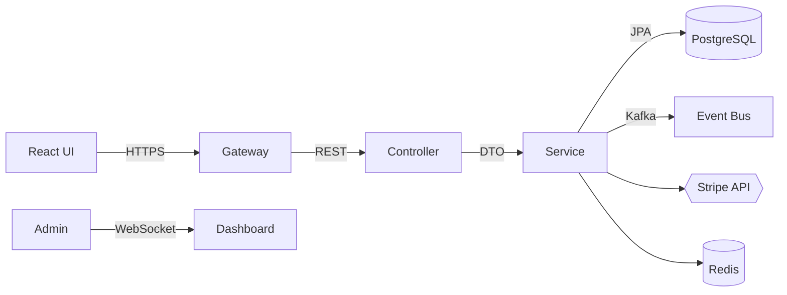

```markdown
# CircleConnect Nexus  &nbsp;    

> A collaborative social‐network engine powered by Spring Boot + React, purpose-built around community **circles** and real-time cooperative experiences.

---

## ✨ Key Capabilities
| Category         | Highlights                                                                                                      |
|------------------|-----------------------------------------------------------------------------------------------------------------|
| Collaboration    | Circle feeds, co-editable events, influence-scored posts, micro-funding & pooled payments.                      |
| Security         | SSL-everywhere, OAuth2 & bearer tokens, rate-limiting, CSRF protection, field-level ACLs.                       |
| Extensibility    | Strict MVC + Component Architecture, plugin-ready middleware chain, domain-driven service layer.                |
| Observability    | Centralized log aggregation (ELK/Opensearch), Prometheus metrics, real-time admin dashboard, audit trails.      |
| DevEx            | Dockerized services, H2 test profile, OpenAPI 3.1 docs, Testcontainers, GitHub Actions CI/CD.                   |

---

## 📂 Project Layout
```
web_social/
├── nexus-api/                 # Spring Boot MVC + REST controllers
│   ├── src/main/java/
│   │   └── com.circle.app/
│   │       ├── auth/          # Security configuration, filters & tokens
│   │       ├── circle/        # Domain aggregate root (Circle, Member, Post …)
│   │       ├── pledge/        # Stripe-backed pledge/payment subsystem
│   │       ├── event/         # Calendar, schedule, voting mechanics
│   │       ├── infra/         # Persistence (JPA), caching, outbox, messaging
│   │       └── web/           # REST + MVC controllers, DTOs, mappers
│   └── src/test/java/         # Unit & integration tests (JUnit 5, Testcontainers)
├── nexus-ui/                  # React 18 SPA widgets + Thymeleaf hybrid pages
├── nexus-gateway/             # Nginx / Spring Cloud Gateway, SSL termination
├── docker/                    # Compose, Helm charts, local dev convenience
└── README.md                  # ← you are here
```

---

## ⚙️ Architecture Overview
* **Model–View–Controller:** Clear separation between domain, delivery and presentation.
* **Repository Pattern:** `JpaRepository` interfaces abstract DB access.
* **Service Layer:** Business rules live in `*Service` beans; transactional and testable.
* **REST API:** JSON-first, documented via SpringDoc + OpenAPI, versioned `/api/v1/**`.
* **Authentication Middleware:** OAuth2 (Google, GitHub) + JWTs; server-side sessions for SSR.
* **Event Sourcing (Outbox):** Domain events persisted and forwarded via Kafka for reactor pipelines.



---

## 🚀 Getting Started

### Prerequisites
* JDK 17+
* Docker & Docker Compose
* Node 18 (for `nexus-ui`)

### Clone & Boot
```bash
git clone https://github.com/circleconnect/nexus.git
cd nexus
./mvnw clean spring-boot:run     # starts API at https://localhost:8443
```

### Local Infra
```bash
docker compose -f docker/dev.yml up  # postgres, redis, kafka, stripe-mock
```

### Access
* Swagger UI — `https://localhost:8443/swagger-ui.html`
* React Dev — `http://localhost:5173` (Vite dev server)
* Admin Panel — `https://localhost:8443/admin`

---

## 🛠️ Build & Test

```bash
# Full CI pipeline (unit + integration + eslint + prettier + cypress)
./mvnw verify -Pci
```

Test coverage summary is printed after run and uploaded to Codecov in CI.

---

## 🧩 Sample Code

### 1. Controller

```java
@RestController
@RequestMapping("/api/v1/circles")
@RequiredArgsConstructor
@Tag(name = "Circles")
public class CircleController {

    private final CircleService circleService;

    @Operation(summary = "Create a new circle")
    @PostMapping
    public ResponseEntity<CircleDto> create(@Valid @RequestBody CreateCircleRequest request,
                                            Authentication auth) {
        var dto = circleService.createCircle(request, auth.getName());
        URI location = ServletUriComponentsBuilder
                .fromCurrentRequest()
                .path("/{id}")
                .buildAndExpand(dto.id())
                .toUri();
        return ResponseEntity.created(location).body(dto);
    }

    @Operation(summary = "Stream circle feed")
    @GetMapping(value = "/{id}/feed", produces = MediaType.TEXT_EVENT_STREAM_VALUE)
    public Flux<PostDto> feed(@PathVariable UUID id,
                              @RequestParam(defaultValue = "20") @Min(1) @Max(100) int size) {
        return circleService.streamFeed(id, size);
    }
}
```

### 2. Repository

```java
public interface CircleRepository extends JpaRepository<Circle, UUID>,
                                          CircleQueryDslRepository {
    @EntityGraph(attributePaths = {"members"})
    Optional<Circle> findBySlugIgnoreCase(String slug);
}
```

### 3. Service

```java
@Service
@RequiredArgsConstructor
@Transactional
public class CircleService {

    private final CircleRepository repo;
    private final DomainEventPublisher publisher;

    public CircleDto createCircle(CreateCircleRequest req, String creatorId) {
        if (repo.existsBySlugIgnoreCase(req.slug())) {
            throw new ConflictException("Slug already taken");
        }
        var circle = Circle.create(req.name(), req.slug(), creatorId);
        repo.save(circle);
        publisher.publish(new CircleCreatedEvent(circle.getId(), creatorId));
        return CircleMapper.toDto(circle);
    }

    @Transactional(readOnly = true)
    public Flux<PostDto> streamFeed(UUID circleId, int size) {
        return Flux.fromIterable(repo.findLatestPosts(circleId, size))
                   .map(CircleMapper::toDto);
    }
}
```

---

## 🔐 Security

1. HTTPS / HSTS enforced by gateway.
2. OAuth2 login (Google, GitHub).  
3. JWT access tokens (15 min) + refresh tokens (30 days).  
4. Role-based method security via `@PreAuthorize`.  
5. Rate-limiting filter (Bucket4J) on sensitive endpoints.

---

## ⚡ Performance Tweaks
* HTTP/2 + gzip
* Caffeine L2 cache for hot feeds
* Async / reactive controllers on IO-heavy endpoints
* Prepared-statement caching & pgbouncer for PostgreSQL

---

## 🔍 Observability
* **Logs:** structured JSON (logback) → Filebeat → Opensearch.
* **Metrics:** Micrometer → Prometheus → Grafana dashboards.
* **Tracing:** OpenTelemetry auto-instrumentation enabled (Jaeger exporter).

---

## 🛡️ Compliance
* GDPR ‑ user data export and deletion
* PCI-DSS SAQ-A – Stripe handles card data
* OWASP Top 10 – dependency and static scanners in CI

---

## 🤝 Contributing

1. Fork & branch off `main`.
2. Follow commit style `feat(circle): add join endpoint`.
3. Ensure `./mvnw verify` passes.
4. Open PR — CI will auto-label and request review.

---

## 🗒️ Changelog
See [CHANGELOG.md](CHANGELOG.md) for version history.

---

## 📜 License
CircleConnect Nexus is released under the Apache License 2.0. See [LICENSE](LICENSE) for details.
```