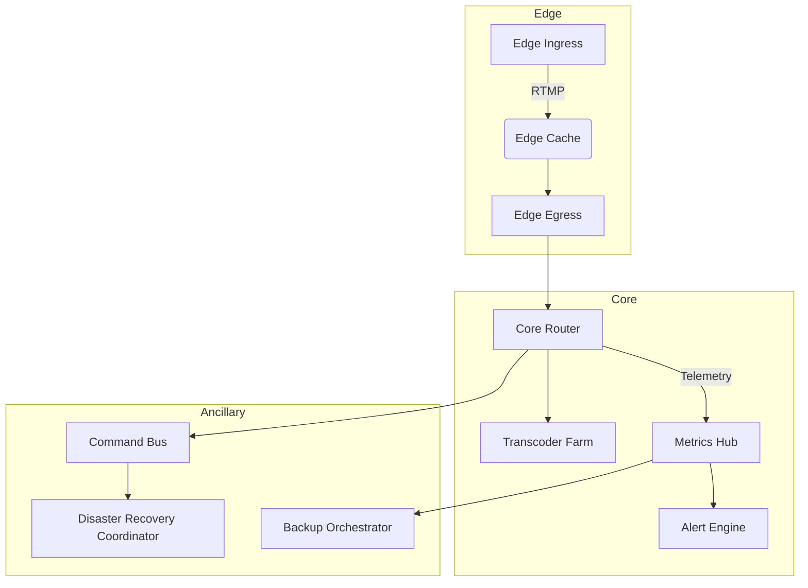
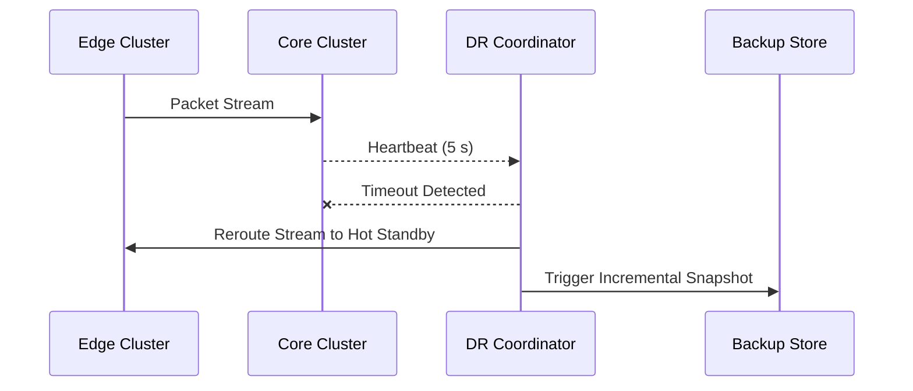

```markdown
# StreamPulse Nexus – Architecture Overview
> Documentation version: **v3.2.0**  
> Last updated: `2024-05-07`

StreamPulse Nexus is a **component-based, event-driven networking platform** engineered to deliver immersive, hyper-reliable media experiences to _millions_ of concurrent viewers. This README serves as the **single-source of truth** for system architects, SREs, and integrators who need to understand how packets, telemetry, and commands propagate through the Nexus fabric.

---

## Table of Contents
1. [High-Level Goals](#high-level-goals)
2. [Component Model](#component-model)
3. [Runtime Data Flow](#runtime-data-flow)
4. [Key Design Patterns](#key-design-patterns)
5. [Extensibility Contracts](#extensibility-contracts)
6. [Failure Domains & Recovery](#failure-domains--recovery)
7. [Security Posture](#security-posture)
8. [Reference Implementation Snippets](#reference-implementation-snippets)
9. [Operational Dashboards](#operational-dashboards)
10. [Contributing](#contributing)

---

## High-Level Goals
* **Carrier-grade reliability** — ≤ 0.2 % frame loss, ≥ 99.999 % uptime  
* **Predictable latency** — ≤ 250 ms glass-to-glass round-trip  
* **Modular evolution** — Swap ingress, transcoding, or analytics without downtime  
* **Observability-first** — Every packet, metric, and event is traceable in < 1 s  
* **Zero-trust** — Mutual TLS + short-lived JWTs across every hop  

---

## Component Model



| Component                    | Responsibility                                                       | Pattern(s)                         |
|------------------------------|----------------------------------------------------------------------|------------------------------------|
| **Edge Ingress / Egress**    | Accepts live media streams and fans out to viewers                  | Strategy (load-balancing)          |
| **Core Router**              | Packet switching & queue orchestration                              | Chain-of-Responsibility            |
| **Transcoder Farm**          | Adaptive bitrate & format conversion                                | Strategy (codec selection)         |
| **Metrics Hub**              | Aggregates logs, traces, metrics                                    | Observer, Event-Driven             |
| **Command Bus**              | Propagates cluster-wide control messages                            | Command, Event-Driven              |
| **Disaster Recovery Coord.** | Rolls out failovers, backups, and restores                          | Chain-of-Responsibility            |

---

## Runtime Data Flow

1. **Ingress** nodes perform protocol termination (RTMP / SRT) and attach a short-lived viewer token.
2. Packets enter the **Edge Cache** (HTTP-FLV / HLS + CDN fallback).
3. **Core Router** distributes frames to:
   * **Transcoder Farm** for ABR ladder generation.
   * **Metrics Hub** for real-time analysis.
4. **Metrics Hub** emits health events; **Alert Engine** pages Ops when thresholds breach.
5. **Command Bus** broadcasts cluster reconfigurations or DR commands derived from Alert Engine.

---

## Key Design Patterns

* **Observer Pattern** — Metrics Hub notifies dashboards and auto-scalers when KPIs change.
* **Command Pattern** — Operational overrides (e.g., “Drain Node X”) flow through the Command Bus.
* **Event-Driven Architecture** — Kafka-compatible event streams decouple producers and consumers.
* **Strategy Pattern** — Pluggable load-balancing and transcoding heuristics.
* **Chain of Responsibility** — Disaster Recovery coordinator can short-circuit on partial failure.

---

## Extensibility Contracts

All pluggable modules MUST implement the following TypeScript interface:

```ts
/**
 * Contract every StreamPulse runtime module must satisfy.
 */
export interface ModuleContract<TConfig = unknown> {
  /**
   * Human-readable identifier used by dashboards and audit logs.
   */
  readonly name: string;

  /**
   * Perform one-time bootstrap actions. Should be idempotent.
   */
  initialize(config: TConfig): Promise<void>;

  /**
   * Subscribe to Platform events (ex: ‘ROUTE_UPDATE’) or metrics.
   */
  subscribe(eventBus: EventBus): void;

  /**
   * Shut down gracefully within the given timeout (ms).
   */
  shutdown(gracePeriod?: number): Promise<void>;
}
```

> NOTE: Runtime modules are lazily loaded via dynamic `import()` to keep the primary event loop unblocked.

---

## Failure Domains & Recovery



Recovery SLA targets:

| Failure Type        | Detection | Failover Window | Data Loss |
|---------------------|-----------|-----------------|-----------|
| Single Node Crash   | ≤ 5 s     | ≤ 3 s           | None      |
| Region-wide Outage  | ≤ 15 s    | ≤ 30 s          | < 3 s     |

---

## Security Posture

1. **Zero-Trust** between internal services (mutual TLS, short-lived SPIFFE SVIDs).
2. **RBAC** enforced by centralized policy engine (Open Policy Agent).
3. Continuous **dependency scanning** via _npm-audit_ & _Snyk_.
4. **Secrets rotation** every 24 h; encrypted with HSM-backed KMS (AES-256-GCM).
5. **WAF** + rate limits at Edge to mitigate volumetric attacks.

---

## Reference Implementation Snippets

Below is a trimmed version of the production **Load Balancer Strategy** that uses **audience heat-maps** to optimize geospatial affinity:

```ts
import { GeoIP, HeatMapService, NodeRegistry } from '@streampulse-nexus/core';
import type { LoadBalancerStrategy } from './types';

/**
 * Geo-Affinity strategy: routes viewers to the lowest-latency region
 * while redistributing 5 % of cold traffic to keep caches warm.
 */
export class GeoAffinityStrategy implements LoadBalancerStrategy {
  private heatMap = new HeatMapService();
  private registry = new NodeRegistry();

  public chooseNode(viewerIp: string): string {
    const viewerRegion = GeoIP.lookup(viewerIp);
    const hotNodes = this.registry.getNodesByRegion(viewerRegion);

    // Burst-aware selection based on real-time heat map
    const ranked = hotNodes.sort(
      (a, b) => this.heatMap.loadFor(a.id) - this.heatMap.loadFor(b.id)
    );

    // 5 % traffic to the “next best” region to keep that cache hot
    const fanOutChance = Math.random() <= 0.05;
    const target = fanOutChance ? ranked[1] ?? ranked[0] : ranked[0];

    if (!target) throw new Error('No eligible node found for viewer request');

    return target.address;
  }
}
```

---

## Operational Dashboards

* **Grafana** — FPS, edge cache hit / miss, ingest bit-rate, end-to-end P99 latency.
* **Kibana** — Structured logs; filters for `SOURCE=EdgeIngress`, `LEVEL>=WARN`.
* **Prometheus** — Alert rules for CPU > 80 % or stream desertion spikes > 1 %.

---

## Contributing

Contributions are welcome! Please:

1. Fork the repo & create a feature branch.
2. Run `npm run lint && npm test`.
3. Submit a PR with:
   * Updated unit & integration tests.
   * Documentation (update this file if architecture changes).
   * An explanation of design decisions.

For major changes, open a discussion in `#architecture` on Slack before coding.

---

© 2024 StreamPulse Labs. All rights reserved.
```