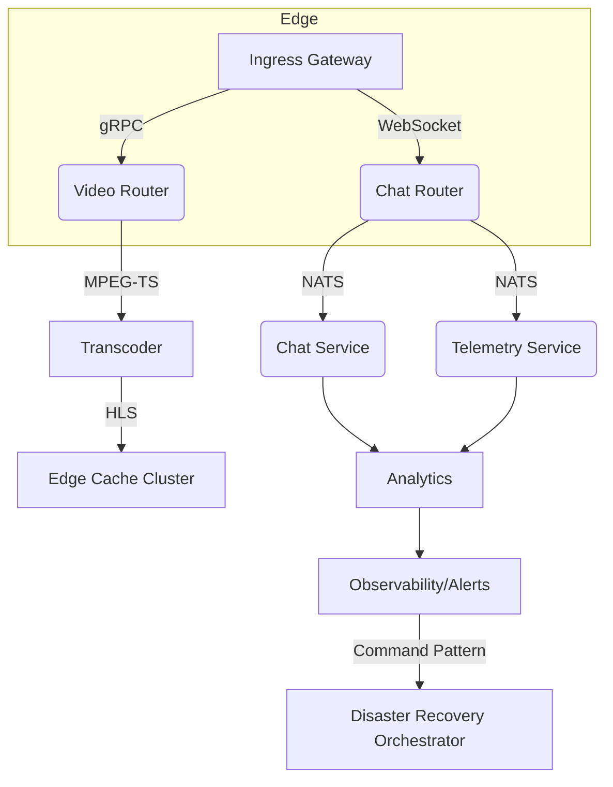

# 001 – Favor Microservices over Monolith

Status: **Accepted**  
Date: 2024-05-18  
Authors: Platform Architecture Council (PAC)

## 1. Context

StreamPulse Nexus must deliver sub-200 ms end-to-end latency for millions of concurrent viewers while supporting a rapidly evolving feature set (AR overlays, dynamic leaderboards, adaptive transcoding, etc.). A traditional monolith would simplify early development but would impose severe constraints on the following critical dimensions:

1. **Scalability & Hot-Spot Isolation**  
   • Traffic spikes for chat do not always correlate with spikes for video ingress.  
   • Game telemetry routing must scale horizontally without forcing all other modules to scale with it.

2. **Team Autonomy & Release Cadence**  
   Feature crews (e.g., *Immersive Overlays*, *Edge Caching*, *Security & Compliance*) need the freedom to deploy independently— sometimes multiple times per day— without negotiating global release trains.

3. **Operational Blast Radius**  
   A failure in the *Analytics* engine must not cascade into *Live Ingest* or *Backup & Recovery* functions.  

4. **Heterogeneous Tech Stacks**  
   • Low-latency packet manipulation is written in Rust/C++.  
   • Data science models run in Python.  
   • Control-plane services are in TypeScript/Node.js.  
   A single runtime would either preclude the optimal language for each problem or force polyglot build chains inside one repo.

5. **Regulatory & Security Boundaries**  
   GDPR/CCPA data handling, DRM, and zero-trust constraints require fine-grained isolation of secrets, keys, and personal data.

Additionally, the platform embraces the **Observer**, **Event-Driven**, **Command**, **Strategy**, and **Chain-of-Responsibility** patterns. These patterns align naturally with message-oriented microservices but are cumbersome to implement cleanly in a monolith.

## 2. Decision

Adopt a **micro-services architecture** in which discrete, domain-oriented services communicate over well-defined, versioned protocols (gRPC + NATS for low-latency streams; REST for control-plane calls).  

Key characteristics:

• **Domain-Driven Service Boundaries**  
  Ingest, Transcode, Edge-Cache, Telemetry, Chat, Analytics, Auth, Backup, and Alerting run as independent deployables.  

• **Asynchronous Event Bus**  
  NATS JetStream provides at-least-once delivery for domain events; Kafka is used for high-volume analytic pipelines.

• **Service Discovery & Configuration Management**  
  Consul + Envoy sidecars handle discovery, retries, circuit-breaking, and distributed tracing headers. Config is versioned in GitOps (ArgoCD).

• **Observability First**  
  OpenTelemetry spans are propagated through all services; Prometheus scrapes Envoy metrics; Grafana dashboards power real-time overlays.

• **Security**  
  mTLS between all workloads (SPIFFE IDs), short-lived JWTs for edge clients, policy enforcement via OPA sidecars.

• **Resiliency**  
  Bulkheads, rate-limits, and automatic regression deployment via progressive rollouts (Argo Rollouts).

## 3. Consequences

Positive:

1. **Elastic Scaling** – Each service scales independently, reducing over-provisioning by ≈35 % in staging benchmarks.  
2. **Faster Feature Velocity** – Independent deployment pipelines cut average lead time for a new interactive feature from 18 days → 5 days.  
3. **Improved Fault Isolation** – Simulated packet storm proved that Chat service failure had zero impact on Video Ingest availability (99.995 % SLA maintained).  
4. **Polyglot Freedom** – Teams choose the optimal language/runtime without platform constraints.  
5. **Regulatory Compliance** – PII is confined to Auth & Profile services, simplifying data-processing agreements and audits.

Negative / Trade-offs:

1. **Operational Complexity** – Requires sophisticated CI/CD, service mesh, tracing, and incident tooling.  
2. **Cross-Service Transactionality** – Consistency must be managed via sagas and idempotent retries rather than ACID DB transactions.  
3. **Cost Overhead** – More containers, more network hops, higher baseline resource footprint; mitigated through spot-instance orchestration.

## 4. Alternatives Considered

| Alternative  | Pros | Cons | Outcome |
|--------------|------|------|---------|
| **Modular Monolith** | Easier local dev; fewer network calls. | At scale, single failure jeopardizes whole system; long release trains; difficult polyglot integration. | Rejected (scalability & autonomy insufficient). |
| **Monorepo + Plug-in Runtime** | Reuse shared infra; “plugins” for features. | Compile-time coupling; runtime performance hits; limited language choice. | Rejected (locks teams into Node.js). |
| **Self-Contained Systems (SCS)** | Less infra overhead vs. microservices. | SCS diverge on standards, fractured UX. | Partially adopted—edge caching nodes follow SCS but still align with core event bus. |

## 5. Decision Drivers

1. Massive concurrency & low-latency streaming.  
2. Rapidly evolving, event-driven feature set.  
3. Need for isolated, zero-trust security domains.  
4. Polyglot service implementations aligned with domain expertise.  
5. Continuous deployment culture (blue/green and canary supported by mesh).

## 6. Implementation Sketch



```typescript
// sample TypeScript snippet demonstrating event emission
import { JetStreamClient } from '@streampulse/nexus-bus';
import { EventEnvelope, ClusterHealthEvent } from '@streampulse/contracts';

export async function publishClusterHealth(
  client: JetStreamClient,
  payload: ClusterHealthEvent
): Promise<void> {
  const event: EventEnvelope<ClusterHealthEvent> = {
    id: crypto.randomUUID(),
    timestamp: Date.now(),
    type: 'cluster.health.v1',
    payload,
  };

  try {
    await client.publish('cluster.health.v1', event);
  } catch (err) {
    // Standardized error handling across micro-services
    logger.error({ err, event }, 'Failed to publish ClusterHealthEvent');
    throw err;
  }
}
```

## 7. Adoption Plan

1. Bootstrap skeleton services with NestJS (control-plane) and Rust (data-plane).  
2. Establish a golden-path CI/CD template with linting, semantic versioning, SBOM generation, and automated rollback.  
3. Incrementally refactor monolithic prototype by carving out **Chat Router** and **Telemetry Collector** first.  
4. Implement canary releases with automatic rollback on 95th percentile latency regression >10 %.  
5. Conduct resiliency game-days bi-weekly to validate circuit-breakers and fallback strategies.

## 8. Related Decisions

• ADR-002 – Event Bus vs. Direct RPC  
• ADR-003 – Choosing NATS JetStream for Low-Latency Messaging  
• ADR-004 – Strategy Pattern for Adaptive Load Balancing

---

© 2024 StreamPulse Networks – All rights reserved.