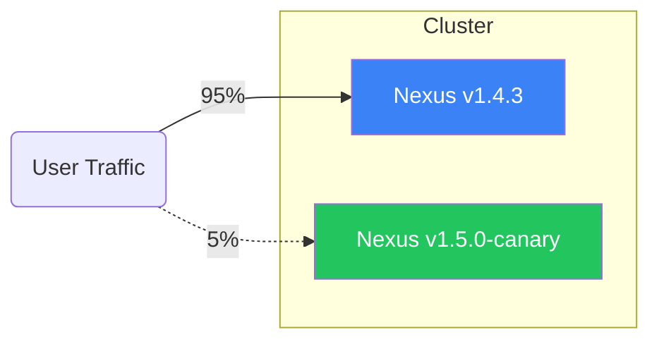

```markdown
<!--
  StreamPulse Nexus – Deployment Pipeline Guide
  File: docs/guides/02-deployment-pipeline.md
  Revision: 1.4.3
  Generated: 2024-06-15
  Author: StreamPulse Core Engineering
-->

# StreamPulse Nexus – Deployment Pipeline

> “If it’s not in CI, it doesn’t exist.” – every on-call engineer, ever

This guide breaks down the **end-to-end deployment pipeline** that ships StreamPulse Nexus from a single pull-request to a **multi-region Kubernetes fleet**—all while guaranteeing zero-downtime, carrier-grade reliability.

The pipeline is composed of the following stages:

1. Pre-Commit Hooks (local)
2. Continuous Integration (GitHub Actions)
3. Security & Compliance Scans
4. Container Build & Registry Promotion
5. Infrastructure as Code (Terraform / Pulumi)
6. Staging Environment (Blue/Green)
7. Canary Release & Real-time Telemetry
8. Production Rollout & Auto-Rollback
9. Post-Deployment Back-ups & Auditing

Each stage is automated but can be short-circuited via Slack-based manual approvals when required (e.g., security hot-fixes, live events).

---

## 1. Repository Layout & Branch Strategy

```text
streampulse-nexus/
├── cmd/                          # CLI entry-points
├── packages/                     # Core libraries & adapters
├── services/                     # Microservices (ingress, transcoder, etc.)
├── charts/                       # Helm charts
├── infra/                        # Terraform/Pulumi IaC
├── scripts/                      # Utility scripts
└── .github/
    ├── workflows/
    │   ├── ci.yml
    │   └── cd.yml
    └── actions/                  # Reusable composite actions
```

Branch model:

* `main` (protected) – production snapshots
* `staging` – integration target, auto-deploys to the **staging** cluster
* `feat/*`, `fix/*` – short-lived branches with PRs targeting `staging`
* `hotfix/*` – emergency patches that ship directly to `main`

---

## 2. Pre-Commit Hooks (Husky + Lint-Staged)

Local hooks guarantee that the codebase always compiles, lints, and passes unit tests **before** it hits the remote:

```bash
#!/bin/sh
# .husky/pre-commit
. "$(dirname "$0")/_/husky.sh"

echo "⚙️  Running pre-commit checks..."

npm run format:check          # Prettier
npm run lint                  # ESLint
npm run test:unit -- --bail   # Jest
```

---

## 3. Continuous Integration

The main CI workflow is defined in **`.github/workflows/ci.yml`**.

```yaml
name: streampulse-ci

on:
  pull_request:
    branches: [ staging, main ]
  push:
    branches: [ staging, main ]

jobs:
  build-test:
    runs-on: ubuntu-22.04
    timeout-minutes: 30

    services:
      redis:
        image: redis:6-alpine
        ports: [ "6379:6379" ]
      nats:
        image: nats:2.9-alpine
        ports: [ "4222:4222" ]

    strategy:
      matrix:
        node: [ 18.x, 20.x ]

    steps:
      - uses: actions/checkout@v4
      - uses: pnpm/action-setup@v2
        with:
          version: 8
      - name: Use Node ${{ matrix.node }}
        uses: actions/setup-node@v3
        with:
          node-version: ${{ matrix.node }}
          cache: 'pnpm'

      - run: pnpm i --frozen-lockfile
      - run: pnpm run lint
      - run: pnpm run test:coverage
      - name: Archive coverage
        uses: actions/upload-artifact@v4
        with:
          name: coverage
          path: coverage

      - name: Static Type Checks
        run: pnpm run typecheck
```

### Key Points

* **Matrix build** ensures code compiles on the LTS Node versions we support.
* **Integration services** (`redis`, `nats`) remove external dependencies.
* Workflow aborts if **any** jest test surpasses the **250 ms** performance budget.

---

## 4. Security & Compliance

After a successful `build-test`, we launch a dedicated job fan-out:

```yaml
  security-scan:
    needs: build-test
    runs-on: ubuntu-22.04
    steps:
      - uses: actions/checkout@v4
      - name: Trivy Scan
        uses: aquasecurity/trivy-action@v0.16.0
        with:
          scan-type: fs
          severity: 'CRITICAL,HIGH'
          exit-code: '1'
      - name: OSS Licensing Compliance
        uses: dtolnay/rust-toolchain@stable # Re-using cache for SPDX-crawler
      - run: pnpm dlx license-checker --onlyAllow 'MIT;Apache-2.0;BSD*'
```

Findings are posted to the **#sec-ops** Slack channel and PR annotations.

---

## 5. Docker Build & Registry Promotion

Image building is triggered for `staging` and `main` pushes.

```yaml
  docker:
    needs: [ build-test, security-scan ]
    runs-on: ubuntu-22.04
    permissions:
      contents: read
      packages: write

    steps:
      - uses: actions/checkout@v4
      - name: Extract image metadata
        id: meta
        uses: docker/metadata-action@v5
        with:
          tags: |
            type=sha,format=long
            type=raw,value=${{ github.ref_name }}
      - name: Set up QEMU
        uses: docker/setup-qemu-action@v3
      - name: Set up Buildx
        uses: docker/setup-buildx-action@v3
      - name: Login to GHCR
        uses: docker/login-action@v3
        with:
          registry: ghcr.io
          username: ${{ github.actor }}
          password: ${{ secrets.GITHUB_TOKEN }}
      - name: Build & push
        uses: docker/build-push-action@v5
        with:
          context: .
          file: ./Dockerfile
          push: true
          platforms: linux/amd64,linux/arm64
          tags: ${{ steps.meta.outputs.tags }}
          labels: ${{ steps.meta.outputs.labels }}
```

Artifacts:

* `ghcr.io/streampulse/nexus:<branch|sha>`
* SBOM exported via `cyclonedx.json` and uploaded to Artifact Hub.

---

## 6. Infrastructure as Code

Infrastructure lives in `infra/` and is managed via **Terraform Cloud** workspaces (`staging`, `prod`).

```bash
# Provision a new edge cache group
make tf PLAN=staging TARGET=module.edge_cache
```

Important conventions:

* **Backend remote state** is encrypted with team-wide HashiCorp Vault transit keys.
* **Least-Privilege** IAM roles are auto-rotated every 30 days by the pipeline.

---

## 7. Continuous Deployment to Kubernetes

The CD workflow (`cd.yml`) performs declarative deployments via **GitOps**:

```yaml
  deploy-staging:
    if: github.ref == 'refs/heads/staging'
    runs-on: ubuntu-22.04
    environment: staging
    steps:
      - name: Checkout Helm charts
        uses: actions/checkout@v4
        with:
          repository: streampulse/charts
          path: charts
          token: ${{ secrets.BOT_PAT }}
      - name: Set image tag
        run: yq e '.image.tag = "${{ github.sha }}"' -i charts/nexus/values-staging.yaml
      - name: Commit & PR bump
        run: |
          git config --global user.email "bot@streampulse.io"
          git config --global user.name "🚀 Nexus Bot"
          git add charts/nexus/values-staging.yaml
          git commit -m "chore(staging): bump nexus to ${{ github.sha }}"
          git push
```

ArgoCD watches the charts repo and syncs **within 30 seconds**. A health-check WebHook notifies Slack (`#deployments`) once all pods report **READY = True**.

---

## 8. Canary & Observability

Canaries are controlled by a custom **CanaryController** (Kubernetes Operator):



Real-time metrics are streamed to **PulseBoard** dashboards:

```js
// packages/metrics/src/publishCanaryStats.ts
import { pulse } from '@streampulse/telemetry';
import { getPodRequests } from './k8s';

export async function publishCanaryStats() {
  try {
    const pods = await getPodRequests('app=nexus', 'canary');
    const averages = pods.map(p => p.latencyMs).reduce((a, b) => a + b) / pods.length;

    await pulse.gauge('canary_latency_avg_ms').publish(averages);
  } catch (err) {
    console.error('[metrics] failed to publish canary stats', err);
    // Forward to PagerDuty (non-blocking)
    await pulse.alert('canary-metrics-failed', err);
  }
}
```

Auto-rollback policy:

* **p99 latency** > 350 ms for 3 consecutive minutes
* **HTTP 5xx** rate > 0.3%
* **Packet loss** > 1.2% (UDP)

If any threshold is breached, the Operator scales the canary to zero and re-routes traffic.

---

## 9. Back-up & Disaster Recovery

Immediately after production deployment, the pipeline triggers:

1. A **Velero snapshot** for persistent volumes (media buffers)
2. A **Postgres WAL** archiving job
3. S3 replication to a cross-region bucket (`us-east-1` → `us-west-2`)

```yaml
  backup:
    needs: deploy-prod
    runs-on: ubuntu-22.04
    steps:
      - name: Trigger Velero snapshot
        run: |
          velero create backup nexus-prod-$(date +%Y%m%d%H%M) \
            --include-namespaces media-buffers \
            --wait
      - name: Confirm snapshot integrity
        run: velero backup describe $(velero backup get -o json | jq -r '.items[-1].metadata.name')
```

---

## 10. Alerting & On-Call Hand-Off

Alerts are unified under **Alertmanager** and routed:

| Severity | Destination    | Action             |
|----------|----------------|--------------------|
| INFO     | #deployments   | No paging          |
| WARN     | VictorOps – L1 | 15-min snooze      |
| CRITICAL | PagerDuty – L0 | Immediate escalation |

A final hand-off message is posted to **#on-call-handoff** summarizing:

* Deployed version
* Canary metrics
* Backup snapshot ID
* Outstanding incidents

---

## 11. Rollback Cheat-Sheet

```bash
# Revert helm release to previous revision
helm -n nexus rollback nexus 269

# Or pin the traffic split back to 100% stable
kubectl -n nexus patch trafficsplit nexus \
  --type='json' -p='[{"op":"replace","path":"/spec/weightStable","value":100},{"op":"replace","path":"/spec/weightCanary","value":0}]'
```

---

## 12. Local Re-Produce

Need to reproduce a canary failure locally?

```bash
pnpm nx run ingress:serve --config=canary.local.yaml
locust -f load_tests/canary_locustfile.py --headless -u 1000 -r 50
```

Observe metrics in Grafana via `http://localhost:3000/d/k8sCanary`.

---

## 13. Further Reading

* `docs/architecture/observer-pattern.md`
* `docs/security/zero-trust.md`
* [Argo Rollouts Best Practices](https://argo-rollouts.readthedocs.io/)
* [SRE Handbook – Release Engineering](https://sre.google/sre-book/release-engineering/)

---

Happy shipping 🚀 – **StreamPulse Nexus** Team
```