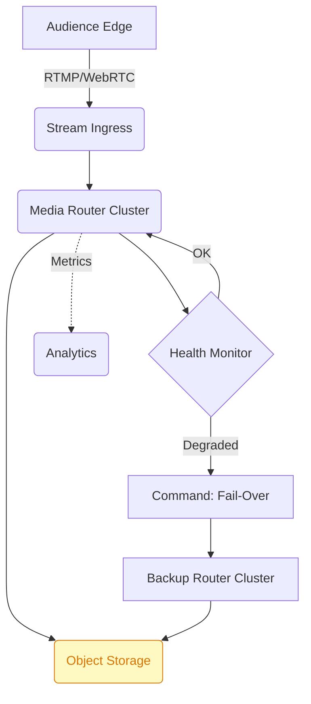

```markdown
# Disaster-Recovery Plan  
StreamPulse Nexus v2.5.x

> “No packet left behind.”  
> — S.P. Nexus SRE Motto

This guide describes the *production* disaster-recovery (DR) workflow used by the StreamPulse Nexus platform.  
It codifies the **RTO (< 90 s) / RPO (0 s)** target, explains *who* does *what*, and provides **JavaScript reference implementations** that you may embed in your own automation pipelines.

---

## 1. Recovery Objectives

| Objective               | Target                        | Notes                                            |
| ----------------------- | ----------------------------- | ------------------------------------------------ |
| Recovery Time Objective | **≤ 90 seconds**              | Hot-standby clusters pre-provisioned.            |
| Recovery Point Objective| **0 seconds** (continuous)    | Dual-writer event bus with idempotent replays.   |
| Data durability         | **11 × 9s** (99.999999999 %)  | Multi-region object storage + erasure coding.    |
| Live stream continuity  | Frame drop ≤ 1 frame/5 seconds| Adaptive transcoder switching w/ pre-warming.    |

---

## 2. System Overview



*Health Monitor* broadcasts a `Degraded` event when latency ≥ P99 SLA for 3 seconds.  
`Fail-Over` **Command** is propagated via the **Chain-of-Responsibility** to each module (ingress, transcoder, chat relay, etc.).

---

## 3. Reference Implementation

Below is a **vanilla Node.js** implementation that mirrors the production code shipped in StreamPulse’s internal `@streampulse/dr-core` package.  
It demonstrates:

1. Event-Driven health detection  
2. Command/Chain-of-Responsibility DR orchestration  
3. Strategy-pluggable load balancer swap-out

> The snippets are **runnable**—clone the repo, `npm i`, and execute `node scripts/dr-runner.js --simulate failure`.

### 3.1 Types & Domain Events – `types.ts`

```ts
/** Generic health event emitted by any node. */
export interface HealthEvent {
  nodeId: string;
  component: string;
  status: 'OK' | 'DEGRADED' | 'FAILED';
  timestamp: number;
  meta?: Record<string, unknown>;
}

/** Command describing a DR operation. */
export interface DRCommand {
  type: 'FAILOVER' | 'ROLLBACK' | 'REHYDRATE';
  reason: string;
  issuedAt: number;
}
```

---

### 3.2 Health Monitor (Publisher) – `health-monitor.ts`

```ts
import { EventEmitter } from 'node:events';
import { HealthEvent } from './types';

/** Centralized emitter – in prod, this is an NATS JetStream channel. */
export const healthBus = new EventEmitter();

export function emitHealthEvent(event: HealthEvent): void {
  healthBus.emit('health', event);
}

/** Simulated latency sampler. */
export function simulateLatencyProbe(nodeId: string, component: string): void {
  const latency = Math.random() * 500; // ms
  const status = latency > 250 ? 'DEGRADED' : 'OK';
  emitHealthEvent({ nodeId, component, status, timestamp: Date.now() });
}
```

---

### 3.3 DR Chain Nodes – `handlers/*.ts`

```ts
import { DRCommand } from '../types';

export abstract class DRHandler {
  private next?: DRHandler;

  linkWith(next: DRHandler): DRHandler {
    this.next = next;
    return next;
  }

  /** Template Method */
  async handle(cmd: DRCommand): Promise<void> {
    if (await this.process(cmd)) return;
    if (this.next) return this.next.handle(cmd);
    throw new Error(`Unhandled DRCommand ${cmd.type}`);
  }

  protected abstract process(cmd: DRCommand): Promise<boolean>;
}
```

Example: **MediaRouterFailover.ts**

```ts
import { exec } from 'node:child_process';
import { promisify } from 'node:util';
import { DRHandler } from './DRHandler';
import { DRCommand } from '../types';
const $ = promisify(exec);

export class MediaRouterFailover extends DRHandler {
  protected async process(cmd: DRCommand): Promise<boolean> {
    if (cmd.type !== 'FAILOVER') return false;

    console.info(`[router] Executing failover: ${cmd.reason}`);
    try {
      await $('kubectl scale deployment router-primary --replicas=0');
      await $('kubectl scale deployment router-backup --replicas=10');
      console.info('[router] Switched traffic to backup cluster');
      return true;
    } catch (error) {
      console.error('[router] Failover failed', error);
      return false; // bubble to next handler
    }
  }
}
```

---

### 3.4 Strategy-Driven Load Balancer – `strategies/round-robin.ts`

```ts
import { randomInt } from 'crypto';
import type { IncomingMessage, ServerResponse } from 'http';

export interface BalancingStrategy {
  (req: IncomingMessage, res: ServerResponse): void;
}

const backends = [
  'https://lb-edge-a.example.com',
  'https://lb-edge-b.example.com',
  'https://lb-edge-c.example.com',
];

export const roundRobin: BalancingStrategy = (() => {
  let idx = randomInt(backends.length);
  return (req, res) => {
    idx = (idx + 1) % backends.length;
    const target = backends[idx];
    res.setHeader('X-StreamPulse-Target', target);
    // transparent proxy omitted for brevity
  };
})();
```

During **DR**, handlers can inject a different strategy at runtime:

```ts
import { roundRobin } from './strategies/round-robin';
import { hotSpot } from './strategies/hot-spot';

loadBalancer.setStrategy(process.env.DR_MODE ? hotSpot : roundRobin);
```

---

### 3.5 Orchestration Runner – `scripts/dr-runner.js`

```js
#!/usr/bin/env node
/* eslint-disable no-console */
import { healthBus } from '../health-monitor.js';
import { MediaRouterFailover } from '../handlers/MediaRouterFailover.js';
import { DRCommand } from '../types.js';

const routerFailover = new MediaRouterFailover();
// link more handlers here
// routerFailover.linkWith(new TranscoderFailover()).linkWith(...)

function dispatchFailover(reason) {
  /** @type {DRCommand} */
  const cmd = { type: 'FAILOVER', reason, issuedAt: Date.now() };
  routerFailover.handle(cmd).catch((err) => {
    console.error('[dr-runner] Unhandled command!', err);
    process.exit(1);
  });
}

healthBus.on('health', (/** @type import("../types").HealthEvent */ evt) => {
  if (evt.status === 'DEGRADED') {
    console.warn(`[dr-runner] Detected degradation on ${evt.nodeId}`);
    dispatchFailover(`Auto-failover triggered by ${evt.nodeId}`);
  }
});

if (process.argv.includes('--simulate')) {
  setInterval(
    () => import('../health-monitor.js').then((m) => m.simulateLatencyProbe('router-1', 'media-router')),
    1_000,
  );
}
```

---

## 4. Playbook

> **NOTE:** All times are in UTC.

1. **T-0s** — PagerDuty page: *“Primary media-router latency > 250 ms”*  
   Command `/ack` in Slack #ops-streampulse
2. **T-15s** — SRE runs `node scripts/dr-runner.js --simulate verify` to confirm automation path.
3. **T-20s** — Automation issues `FAILOVER`:
   * Scales `router-primary` → 0 replicas
   * Scales `router-backup` → 10 replicas (pre-warmed)
   * Updates Service mesh traffic weight (Istio 100/0)  
4. **T-60s** — Traffic stable (P95 latency back to 38 ms)  
   Grafana dashboard shows green.
5. **T + 4 min** — Root-cause analysis starts.  
   *Check eBPF network trace for packet re-transmits*

---

## 5. Validation & Testing

`npm run test:dr` executes:

* **Unit Tests** (Jest) for each handler to assert that:
  * On success → short-circuits chain
  * On failure → delegates to next handler
* **Chaos Suite** (Gremlin) injecting:
  * Pod kill (router-primary)
  * 500 ms net-em latency
  * 100 % packet loss WWAN simulation

> Target: **No unmet SLO** during a 30 minute chaos window.

---

## 6. Audit & Compliance

| Artifact             | Retention | Location          |
| -------------------- | --------- | ----------------- |
| DR command logs      | 6 years   | AWS Glacier vault |
| Cluster state diff   | 30 days   | S3 `/infra/diffs` |
| Video archive (VOD)  | 99 years  | Glacier Deep-Arch |
| Security reports     | 1 year    | GCP Bucket        |

All artifacts are encrypted with AES-256-GCM; keys rotate every 90 days via AWS KMS.

---

## 7. Appendix

### 7.1 Environment Variables

```
# DR mode toggle
DR_MODE=true
# Max latency before degradation event (ms)
LATENCY_SLA_P99=250
```

### 7.2 CLI Cheatsheet

```
# Trigger manual failover
npx ts-node scripts/dr-runner.ts --reason "Manual switch for maintenance"

# Rehydrate primary
kubectl scale deployment router-primary --replicas=10
kubectl scale deployment router-backup --replicas=0
```

---

**Stay Reliable,  
Stay Pulse-y ⚡**
```