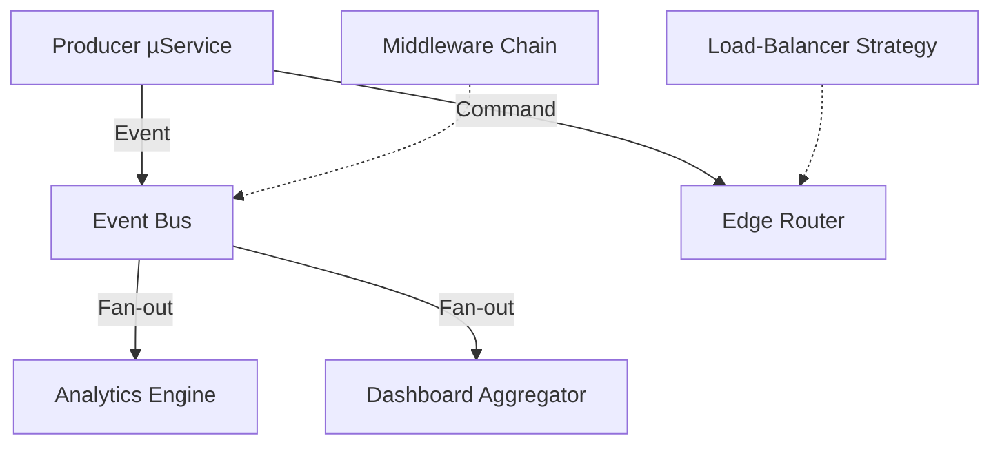

```markdown
# `@streampulse-nexus/service-interaction`

> High-density interaction layer for StreamPulse Nexus nodes  
> Orchestrates **signals**, **commands**, and **events** between media routers, analytics engines, and edge clusters—while enforcing zero-trust security and carrier-grade resilience.

---

## ✨ Key Features

| Capability                           | Description                                                                                           |
| ------------------------------------ | ----------------------------------------------------------------------------------------------------- |
| Transport Abstraction                | gRPC, WebSocket, HTTP/2, and QUIC are pluggable—swap protocols at runtime.                            |
| Event Bus (Observer + Event-Driven)  | Publish/Subscribe broker with dynamic topic discovery & back-pressure awareness.                      |
| Command Dispatch (Command Pattern)   | Synchronous or deferred command routing across cluster boundaries with resumable workflows.           |
| Strategy Injection                   | Hot-swap load-balancing and throttling algorithms without redeploying a node.                         |
| Chain-of-Responsibility Middleware   | Fine-grained request pipelines—attach auth, tracing, or transformation stages on the fly.             |
| Built-in Telemetry                   | Prometheus-compatible metrics + OpenTelemetry tracing; integrates with StreamPulse Live Dashboards.   |
| Disaster Recovery Hooks              | Snapshot/restore orchestration gets first-class treatment—no more one-off scripts.                    |

---

## 📦 Installation

> Requires Node.js ≥ 18.x and a compatible TypeScript toolchain (optional but recommended).

```bash
# Via npm
npm i @streampulse-nexus/service-interaction

# Or via pnpm / yarn
pnpm add @streampulse-nexus/service-interaction
yarn add @streampulse-nexus/service-interaction
```

---

## 🚀 Quick Start

```ts
import {
  ServiceInteraction,
  WsTransport,
  JsonSerializer,
  RoundRobinStrategy,
} from '@streampulse-nexus/service-interaction';

// 1️⃣  Spin up the interaction layer — transport + serializer + strategy
const interaction = new ServiceInteraction({
  transport: new WsTransport({ url: 'wss://edge-nyc-01.streampulse.live' }),
  serializer: new JsonSerializer(),
  strategy: new RoundRobinStrategy(),
});

// 2️⃣  Subscribe to system-wide events
const sub = interaction.events.subscribe('media.transcoder.*', (evt) => {
  console.log(`[${evt.topic}] latency=${evt.payload.ms}`);
});

// 3️⃣  Dispatch a command to nudge edge cache
await interaction.commands.send({
  id: 'purge-cache',
  target: 'edge-cache-42',
  payload: { path: '/vod/highlights' },
});

// 4️⃣  Clean up (process signals are handled internally)
await interaction.close();
```

---

## 🧩 Pluggable Architecture



* Build your own **Transport** (QUIC? MQTT? SIG-ABRT? No problem).  
* Inject a **Strategy** (`./strategies/*`) for time-sensitive formats (battle-royale, DJ sets, VR theatre).  
* Compose **Middleware** (`beforeSend`, `afterReceive`) to add cross-cutting concerns.

---

## API Surface (TL;DR)

> Full JSDoc & TypeScript declarations ship with the package.

### class `ServiceInteraction`

| Method                           | Description                                                     |
| -------------------------------- | --------------------------------------------------------------- |
| `constructor(opts)`              | Bootstrap with `transport`, `serializer`, `strategy`, `logger`. |
| `events.subscribe(topic, cb)`    | Observe event streams (`*`, `**` wildcard support).             |
| `events.emit(topic, payload)`    | Fire-and-forget broadcast.                                      |
| `commands.send(Command)`         | Promise-based command execution with retries & fallback.        |
| `use(middleware)`                | Register CoR middleware (`(ctx, next)`) signature.              |
| `close()`                        | Gracefully flush buffers and detach listeners.                  |

### Types

```ts
interface Command<T = unknown> {
  id: string;             // "reset-router"
  target: string;         // "router-999"
  payload: T;             // Arbitrary JSON-serialisable
  timeout?: number;       // ms
}
```

---

## 🛡️ Security-First Principles

1. **Zero-Trust**: Every inbound message undergoes authN + authZ chain (mTLS, JWT, or pluggable).
2. **Rate-Limiting**: Token-bucket implementation prevents cross-node abuse.
3. **Immutable Logs**: All state transitions append to an audit feed (optional KMS encryption).

---

## 🏗️ Example: Custom Load-Balancing Strategy

```ts
import { LoadBalancingStrategy, NodeSnapshot } from '@streampulse-nexus/service-interaction';

/**
 * Latency-Aware algorithm.
 * Picks the node with the lowest smoothed RTT using EWMA.
 */
export class LatencyAwareStrategy implements LoadBalancingStrategy {
  #alpha = 0.25; // weight factor
  #rtt: Map<string, number> = new Map();

  pick(nodes: NodeSnapshot[]): NodeSnapshot | null {
    if (!nodes.length) return null;

    // Prefer nodes with explicit RTT; otherwise initialise with Infinity
    return nodes.reduce((best, node) => {
      const prev = this.#rtt.get(node.id) ?? Infinity;
      const updated = prev * (1 - this.#alpha) + node.metrics.rtt * this.#alpha;
      this.#rtt.set(node.id, updated);
      return updated < (this.#rtt.get(best.id) ?? Infinity) ? node : best;
    }, nodes[0]);
  }
}
```

Register the strategy at runtime:

```ts
interaction.strategy = new LatencyAwareStrategy();
```

---

## 🛠️ Development

```bash
git clone git@github.com:StreamPulse/streampulse-nexus.git
cd packages/service-interaction
pnpm i
pnpm test            # Jest + ts-jest
pnpm lint            # ESLint + Prettier
pnpm dev             # Nodemon auto-reload playground
```

Run integration tests against a local broker:

```bash
docker compose -f ./ops/docker/docker-compose.dev.yml up -d
pnpm test:int
```

---

## 🐛 Error Handling & Observability

```ts
interaction.on('error', (err) => {
  logger.error('service-interaction fault', err);
  // Optional: escalate to pagerduty
});

interaction.metrics.pipe(
  new PrometheusPushGateway({ job: 'interaction-layer', interval: 15_000 })
);
```

Service-Interaction uses an **Exponential Back-off Jitter** algorithm (`utils/retry.ts`) for transient network failures and emits circuit-breaker events:

```
[x] breaker.open     node=edge-42 reason="connect ETIMEDOUT"
[ ] breaker.halfOpen node=edge-42
[ ] breaker.close    node=edge-42
```

---

## 📄 License

Apache 2.0 © StreamPulse Engineering
```
