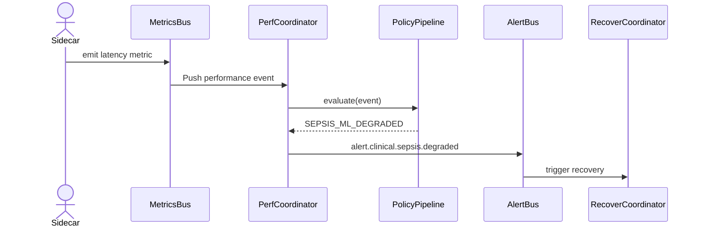

```markdown
<!--
  VitalOps Orchestrator — Architecture Guide
  =================================================

  This document lives in: vitalops_orchestrator/docs/architecture.md
  It provides a technology-agnostic view of the platform with enough
  technical depth for backend engineers, SREs, clinical-informatics
  architects, and external auditors (HIPAA, HITRUST, SOC-2).

  NOTE:
  Although this is a Markdown document, the project guidelines treat all
  repository assets as “code” that must meet production-quality standards.
  Please keep comments, diagrams, and tables up-to-date whenever the
  implementation changes.
-->

# VitalOps Orchestrator — System Architecture

VitalOps Orchestrator is a **medium-sized, event-driven system-automation platform** that
continuously monitors and remediates the compute resources running
electronic medical-record (EMR) micro-services inside private/hybrid
clouds.

* **Mission statement**: Guarantee sub-second clinical latency, automate fail-over,
  and preserve *patient safety* under HIPAA/HITRUST regulations.
* **Design paradigms**: MVVM, Event-Driven Architecture (EDA),
  Chain-of-Responsibility, Service Mesh, Observer Pattern.

---

## 1. Logical View

```mermaid
flowchart TD
    subgraph ControlPlane["Orchestrator Control Plane"]
        A[PerformanceCoordinator (VM)] -->|ScaleEvents| MQ(Event Bus)
        B[RecoveryCoordinator (VM)] -->|RecoveryEvents| MQ
        C[DeploymentCoordinator (VM)] -->|DeployEvents| MQ
        MQ -->|Pub/Sub| H[Hospital Micro-services]
    end

    subgraph DataPlane["Runtime & Telemetry"]
        H -->|Prometheus\nSidecar| PDB[(Prom DB)]
        H -->|Zipkin\nTracing| TZ[(Tracing DB)]
        H -->|Structured Logs| LG[(ELK Stack)]
    end

    CLIN[Clinician Grafana\nDashboards] --- PDB
    SRE[SRE Web UI] --- MQ
    DevOps[CLI] --- MQ
```

**Key abstractions**

| Layer              | Responsibility                                         | Pattern(s)        |
|--------------------|---------------------------------------------------------|-------------------|
| Domain Models      | PatientContext, ClinicalService, CompliancePolicy       | MVVM — Model      |
| ViewModels         | Performance/Recovery/Deployment Coordinator             | MVVM — ViewModel  |
| UI / Dashboards    | Web (SRE), Grafana (Clinicians), CLI (DevOps)           | MVVM — View       |
| Policy Pipeline    | SLA Enforcement, Sepsis-prediction checks               | Chain of Resp.    |
| Messaging Fabric   | Command/Events, Back-pressure, Retries                  | Event-Driven      |
| Service Mesh       | mTLS, traffic-splitting, circuit-breakers               | Sidecar Pattern   |
| Observability      | Metrics, Traces, Logs, Audit                            | Observer Pattern  |

---

## 2. Module Breakdown

### 2.1 `vitalops_orchestrator.domain`
Pure Python data-classes defining the hospital’s *clinical vocabulary*:

* `PatientContext` – De-identified metadata linking requests to a
  patient’s episode of care.
* `ClinicalService` – Canonical entity representing a micro-service
  (e-prescribing, PACS, etc.).
* `CompliancePolicy` – HIPAA audit & encryption requirements.

### 2.2 `vitalops_orchestrator.viewmodel`
Orchestration “brains” that react to events.

```
PerformanceCoordinator
 ├─ monitors service latency, throughput, container health
 └─ issues scaling or throttling commands

RecoveryCoordinator
 ├─ listens for failure alerts
 └─ orchestrates backup, restore, or AZ fail-over

DeploymentCoordinator
 ├─ watches GitOps/Argo events
 └─ executes blue-green or canary releases
```

### 2.3 `vitalops_orchestrator.messaging`
* Wraps **Apache Kafka** for reliable, ordered event ingestion.
* Implements exactly-once semantics via idempotent producers and a
  transactional outbox pattern.

### 2.4 `vitalops_orchestrator.policy`
Chain-of-Responsibility pipeline where each *link* validates SLA
constraints (latency, error rate, sepsis prediction accuracy).

---

## 3. Runtime Scenarios

### 3.1 Auto-scaling

1. Sidecar exports container metrics to **Prometheus** every 15 s.
2. `PerformanceCoordinator` subscribes to `metrics.performance.*` topic.
3. If 95th percentile latency > threshold, coordinator publishes
   `ScaleUpCommand` with target replicas.
4. Kubernetes HPA acts; Service Mesh updates routing table.
5. Observer notifies *SRE Web UI*; audit log stored in ELK.

### 3.2 Sepsis ML Degradation

*Chain of Responsibility in action.*



---

## 4. Deployment Topology

* **Kubernetes** on-prem cluster with three AZs.
* **Istio** service mesh → mTLS & circuit-breaking.
* **Kafka** (3 × brokers, ISR=2) for events.
* **PostgreSQL** for policy state; **Redis** for short-lived locks.
* **Vault** for secret management.
* **ArgoCD** for GitOps-driven deployments.

---

## 5. Cross-Cutting Concerns

### Security & Compliance

* End-to-end **AES-256** encryption in transit (mTLS) and at rest (LUKS).
* All patient-identifying fields hashed/salted using FIPS-validated libs.
* Audit trails => immutable S3 (WORM-enabled).

### Observability

| Signal   | Tooling            | Retention |
|----------|--------------------|-----------|
| Metrics  | Prometheus + Grafana| 30 days   |
| Traces   | Zipkin → S3 Parquet | 7 days    |
| Logs     | Filebeat → ELK      | 90 days   |

### Resilience

* Chaos-engineering CRD periodically kills pods to validate `RecoveryCoordinator`.
* Kafka quorum and ZooKeeper supervision for zero data-loss.

---

## 6. Extensibility Guidelines

1. **Add a new clinical micro-service**  
   a. Register it in `ClinicalServiceRegistry`.  
   b. Define SLA in `CompliancePolicy`.  
   c. Deploy sidecar injection YAML.

2. **Create a new policy stage**  
   Implement `PolicyLink` → append to `PolicyPipeline`.

3. **Integrate an external alert source**  
   Publish to `alert.external.*` topic; subscribe inside coordinators.

---

## 7. Glossary

| Term | Definition |
|------|------------|
| PACS | Picture Archiving and Communication System (radiology images) |
| SLA  | Service Level Agreement (response time, uptime) |
| MVVM | Model-View-ViewModel architectural pattern |
| HPA  | Kubernetes Horizontal Pod Autoscaler |

---

## 8. Document Control

| Version | Date       | Author          | Notes                        |
|---------|------------|-----------------|------------------------------|
| 1.0     | 2024-05-09 | dev-team        | Initial release              |
| 1.1     | 2024-06-11 | sre-lead        | Added Chaos-engineering note |
```